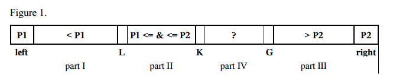
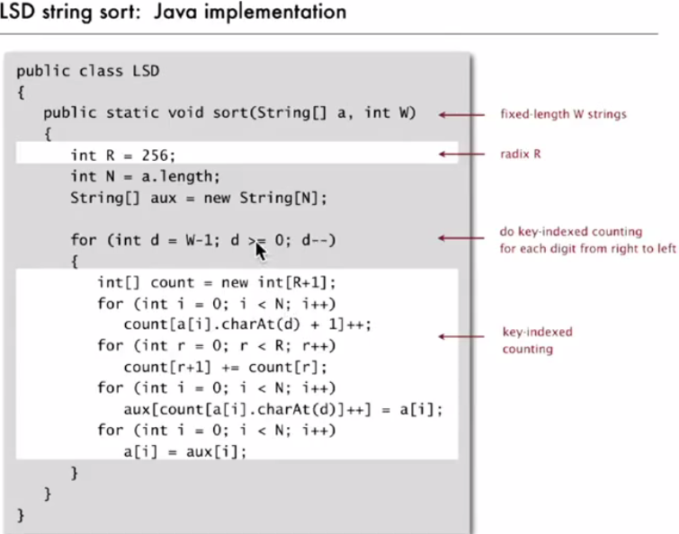

# Searching

## Binary Search

## Implementation code

```java
public int binarySearch(int a[], int key) {

		int low = 0, mid, high = a.length - 1;

		while (low <= high) {
			mid = low + (high - low)/ 2;
			if (a[mid] == key) {
				return mid;
			} else if (a[mid] < key) {
				low = mid + 1;
			} else {
				high = mid - 1;
			}
		}
		return -1;
	}
```

## Problems on binary search

??


---

# Sorting

A **stable sort** is one that's guaranteed not to reorder elements with identical keys.

## Insertion sort

- Insertion sort is an efficient algorithm for **sorting a small number of elements**. 

- The algorithm sorts the input numbers in place: it rearranges the numbers within the array A, with at most a constant number of them stored outside the array at any time.

```java
public void insertSort(int[] a) {
	int key;

	for (int i = 1; i < a.length; i++) {
		key = a[i];
		int j = i - 1;
		while (j >= 0 && a[j] < key) {
			a[j + 1] = a[j];
			j = j - 1;
		}
		a[j + 1] = key;
	}

}
```

**Compact version**

```java
public void swap(int[] a, int i, int j) {
		int temp = a[i];
		a[i] = a[j];
		a[j] = temp;
	}

public void insertSortCompact(int[] a) {
	for (int i = 1; i < a.length; i++) {
		for (int j = i; j > 0 && a[j] < a[j - 1]; j--) { 
			swap(a, j, j - 1);
		}
	}
}
``` 


Running time: **O(n<sup>2</sup>)**

 
[java code](./sorting/InsertionSort.java)
   
---

## Selection Sort

This sorting algorithm is an in-place comparison-based algorithm in which the list is divided into two parts, the sorted part at the left end and the unsorted part at the right end. Initially, the sorted part is empty and the unsorted part is the entire list.

The smallest element is selected from the unsorted array and swapped with the leftmost element, and that element becomes a part of the sorted array. This process continues moving unsorted array boundary by one element to the right.

This algorithm is not suitable for large data sets as its average and worst case complexities are of Ο(n2), where n is the number of items.

```java
public void selectSort(int a[]) {
		for (int i = 0; i < a.length - 1; i++) {
			int min = i;
			for (int j = i + 1; j < a.length; j++) {
				if (a[min] > a[j])
					min = j;
			}
			if (i != min) {
				swap(a, min, i);
			}
		}
	}
```

---

## MergeSort

When you need a stable, O(N log N) sort, this is about your only option. The only downsides to it are that it uses O(N) auxiliary space and has a slightly larger constant than a quick sort.

Merge Sort is a Divide and Conquer algorithm. It divides input array in two halves, calls itself for the two halves and then merges the two sorted halves. The `merge()` function is used for merging two halves. 

```java

// initially p = 0; r = a.length -1;
public int[] mergeSort(int a[], int p , int r) {
		if (p < r) {
			int q = (p + r) / 2;
			mergeSort(a, p, q);
			mergeSort(a, (q + 1), r);
			merge(a, p, q, r);
		}
		return a;
	}
	
public void merge(int a[], int p, int q, int r) {
		int n1 = q - p + 1;
		int n2 = r - q ;

		int[] auxLeft = new int[n1];
		int[]  auxRight = new int [n2];

		for (int i = 0; i < n1; i++) {
			auxLeft[i] = a[p + i];
		}

		for (int j = 0; j < n2; j++) {
			auxRight[j] = a[q + 1 + j];
		}

		/*int i = 0, j = 0;
		int k = p;

		while (i < n1 && j < n2) {
			if (auxLeft[i] <= auxRight[j]) {
				a[k] = auxLeft[i];
				i++;
			} else {
				a[k] = auxRight[j];
				j++;
			}
			k++;
		}

		while (i < n1) {
			a[k] = auxLeft[i];
			i++;
			k++;
		}

		while (j < n2) {
			a[k] = auxRight[j];
			j++;
			k++;
		}
		*/

		for (int k = p, i = 0, j = 0; k <= r; k++) {
			if (i < n1 && j < n2) {
				if (auxLeft[i] <= auxRight[j]) {
					a[k] = auxLeft[i];
					i++;
				} else {
					a[k] = auxRight[j];
					j++;
				}
			} else if (i < n1 && j >= n2) {
				a[k] = auxLeft[i];
				i++;
			} else if (i >= n1 && j < n2) {
				a[k] = auxRight[j];
				j++;
			}
		}

	}	
```

### Application of Merge Sort

- **Merge Sort is useful for sorting linked lists in O(N Log<sub>2</sub> N) time**. In case of linked lists the case is different mainly due to difference in memory allocation of arrays and linked lists. Unlike arrays, linked list nodes may not be adjacent in memory. Unlike array, in linked list, we can insert items in the middle in O(1) extra space and O(1) time. Therefore merge operation of merge sort can be implemented without extra space for linked lists.


---

## QuickSort

QuickSort works by partitioning the input array into 3 arrays. We choose the last element of the array as the pivot element and then we scan from the 0<sup>th</sup> element to the last but one element. While scanning if the element is smaller than the pivot it is being kept in the first array and if the element is larger than the pivot it is being kept in the second array. Finally the pivot element is replaced with the first element of the second array (i.e. array of the elements larger than the pivot element). The pivot is now at its correct position in the finally sorted array. 

We repeat this procedure both to left and right arrays of the pivot.

The Worst case running time is n<sup>2</sup> and the average case is O(n * log n).

Not Stable.

```java
public void sort(int[] a, int p, int r) {
		if (p < r) {
			int q = partition(a, p, r);
			sort(a, p, q - 1);
			sort(a, q + 1, r);
		}
	}

public int partition(int[] a, int p, int r) {
		int x = a[r];
		int i = p - 1;
		for (int j = p; j < r; j++) {
			if (a[j] <= x) {
				i++;
				int temp = a[i];
				a[i] = a[j];
				a[j] = temp;
			}
		}
		int temp2 = a[i + 1];
		a[i + 1] = a[r];
		a[r] = temp2;
		return i + 1;
	}
```

[java code](./sorting/QuickSort.java)

---

## Dual Pivot Quick Sort



1. For small arrays (length < 27), use the Insertion sort algorithm. (??)

2. Choose two pivot elements P1 and P2. We can get, for example, the first element a[left] as P1 and the last element a[right] as P2.

3. P1 must be less than P2, otherwise they are swapped. So, there are the following parts:
	- part I with indices from left+1 to L–1 with elements, which are less than P1,
	- part II with indices from L to K–1 with elements, which are greater or equal to P1 and less or equal to P2,
	- part III with indices from G+1 to right–1 with elements greater than P2,
	- part IV contains the rest of the elements to be examined with indices from K to G.

4. The next element a[K] from the part IV is compared with two pivots P1 and P2, and placed to the corresponding part I, II, or III.

5. The pointers L, K, and G are changed in the corresponding directions.

6. The steps 4 - 5 are repeated while K ≤ G.

7. The pivot element P1 is swapped with the last element from part I, the pivot element P2 is swapped with the first element from part III.

8. The steps 1 - 7 are repeated recursively for every part I, part II, and part III.

[DualPivotQuicksort](./DualPivotQuicksort.pdf)

---

We compare sorting methods by the number of the most "expensive" operations, which influence on effectiveness of the sorting techniques, — comparisons and swaps. Quicksort algorithm is an effective and wide-spread sorting procedure with ** C*n*ln(n) ** operations, where **n** is the size of the arranged array. The problem is to find an algorithm with the least coefficient **C**.

---

To DO
----

- Randomized version of Quicksort? Picking a random element rather than the last. ==>  Select Random element and swap it with last element.

- Quicksort variation for duplicate elements in input.


---

## Heapsort

Not Stable

Running time: `O(n * log n)`

The (binary) heap data structure is an array object that we can view as a nearly [complete binary tree](./../DS/Tree/tree_chap1.md). The tree is completely
filled on all levels except possibly the lowest, which is filled from the left up to a point. An array A that represents a heap is an object with two attributes:
A:length, which (as usual) gives the number of elements in the array, and A:heap-size, which represents how many elements in the heap are stored within
array A. That is, although A[1...A:length] may contain numbers, only the elements in A[1...A:heap-size], where 0 <= A:heap-size <= A:length, are valid elements of the heap.
	
**Heap features**
 - The minimum and maximum number of elements in a heap of height h are between 2^h and (2^(h+1) - 1) respectively.
 - With the array representation for storing an n-element heap, the leaves are the nodes indexed by [n/2]+1, [n/2]+2 ,...,n.
	
[heapsort java code](./sorting/HeapSort.java)	

---

## Counting Sort

Linear sorting algorithm that can sort in O(n) time. It has a condition that the input is in range of [0-K] where K is some integer.

### Steps for counting sort

- Create a new array (Count Array) of length `k+1` where k is the input range (0 - k).

- Count the frequency of each digit using key as the index in the Count Array

- Update the Count Array with running sum i.e. Number of elements before current elements by adding its previous element value.

- Create a new Array of the size of original array. Access cumulates using key as index to move items.

```java
public static void countSort(int[] a, int k) {

		int n = a.length;

		int[] c = new int[k + 1];
		int[] b = new int[a.length];

		// Count frequency of each digit using key as index.
		for (int i = 0; i < n; i++) {
			c[a[i] + 1]++;
		}

		// Compute frequency cumulates which specify destinations.
		for (int i = 0; i < k; i++) {
			c[i + 1] += c[i];
		}

		// Access cumulates using key as index to move items.
		for (int i = 0; i < n; i++) {
			b[c[a[i]]++] = a[i];
		}

		// Copy back to the original array
		for(int i=0; i<n; i++){
			a[i] = b[i];
		}
	}
```

[Counting Sort code](./sorting/CountSort.java)

---

## Radix Sort


