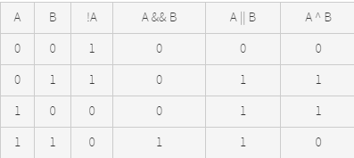

# Bit Algorithms
---

## Bit Manipulation

The heart of bit manipulation are the bit-wise operators **&** (and), **|** (or), **~** (not) and **^** (xor). 

**Truth Table**



The other two operators are the shift operators **a << b** and **a >> b**. The former shifts all the bits in **a** to the left by **b** positions; the latter does the same but shifts right. For non-negative values, the newly exposed bits are filled with zeros.

Think of left-shifting by **b** as multiplication by **2<sup>b</sup>** and right-shifting as integer division by **2<sup>b</sup>**. 

Set union - **A | B**

Set intersection - **A & B**

Set subtraction - **A & ~B**

Set negation - **ALL_BITS ^ A**

Set bit - **A |= 1 << bit**

Clear bit - **A &= ~(1 << bit)**

Test bit - **(A & 1 << bit) != 0**

- check if a number is a power of 2.

---

## Some Pointers

- When executing shift instructions for **a << b**, the x86 architecture uses only the bottom 5 bits of **b**(6 for 64-bit integers). This means that shifting left (or right) by 32 does nothing, rather than clearing all the bits. This behaviour is also specified by the Java and C# language standards; C99 says that shifting by at least the size of the value gives an undefined result

- The **&** and **|** operators have lower precedence than comparison operators. That means that **x & 3 == 1** is interpreted as **x & (3 == 1)**, which is probably not what you want.

- Java only has signed types: **>>** will sign-extend values (which is probably not what you want), but the Java-specific operator **>>>** will shift in zeros.

---

## COMPUTING PARITY

The parity of a sequence of bits is 1 if the number of Is in the sequence is odd; otherwise, it is 0. Parity checks are used to detect single bit errors in data storage and communication.


---

## Binary Indexed Tree


---

## Questions
---

### Detect if two integers have opposite signs.
	
Let the given integers be x and y. The sign bit is 1 in negative numbers, and 0 in positive numbers. The XOR of x and y will have the sign bit as 1 iff they have opposite sign. In other words, XOR of x and y will be negative number number iff x and y have opposite signs. 	
	
```java
public static boolean areOppositeSigns(int x, int y) {
		return ((x ^ y) < 0);
	}
```	

