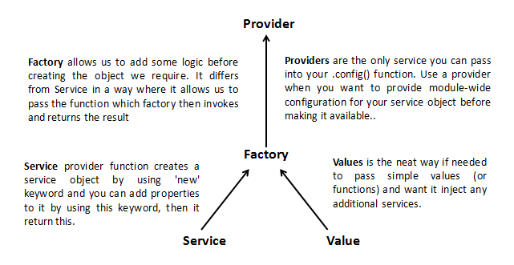

# Angular-JS
---

## Angular Modules

*Module is a container for the different parts of your app – controllers, services, filters, directives, etc*.
Most applications have a main method that instantiates and wires together the different parts of the application.
AngularJS apps don't have a main method. Instead modules declaratively specify how an application should be bootstrapped. 

Advantages to this approach :

- The declarative process is easier to understand.
- You can package code as reusable modules.
- The modules can be loaded in any order (or even in parallel) because modules delay execution.
- Unit tests only have to load relevant modules, which keeps them fast.
 
 
```javascript
// declare a module
var myAppModule = angular.module('myApp', []);

// configure the module.
// in this example we will create a greeting filter
myAppModule.filter('greet', function() {
 return function(name) {
    return 'Hello, ' + name + '!';
  };
});
```

`angular.Module` : Interface for configuring AngularJS modules.

**Module Methods**

We can specify functions to run at configuration and run time for a module by calling the `config` and `run` methods. These functions are injectable with dependencies just like the factory functions above.

```
angular.module('myModule', [])
.config(['depProvider', function(depProvider) {
  // ...
}])
.run(['depService', function(depService) {
  // ...
}]);

```

https://docs.angularjs.org/guide/module#module-loading-dependencies

---
 
## Dependency Injection

Dependency Injection (DI) is a software design pattern that deals with how components get hold of their dependencies.

The AngularJS injector subsystem is in charge of creating components, resolving their dependencies, and providing them to other components as requested.

- Components such as services, directives, filters, and animations are defined by an injectable factory method or constructor function. These components can be injected with "service" and "value" components as dependencies.

- Controllers are defined by a constructor function, which can be injected with any of the "service" and "value" components as dependencies, but they can also be provided with special dependencies. See Controllers below for a list of these special dependencies.

 
**config method** : Use this method to register work which needs to be performed on module loading.

The config method accepts a function, which can be injected with "provider" and "constant" components as dependencies. Note that you cannot inject "service" or "value" components into configuration.

**run method**

The run method accepts a function, which can be injected with "service", "value" and "constant" components as dependencies. Note that you cannot inject "providers" into run blocks.


To manage the responsibility of dependency creation, each AngularJS application has an injector. The injector is a service locator that is responsible for construction and lookup of dependencies.


---

## Controllers

Controllers are "classes" or "constructor functions" that are responsible for providing the application behavior that supports the declarative markup in the template

Unlike services, there can be many instances of the same type of controller in an application.

---

## Providers

Each web application you build is composed of objects that collaborate to get stuff done. These objects need to be instantiated and wired together for the app to work. In AngularJS apps most of these objects are instantiated and wired together automatically by the injector service.

- The injector uses recipes to create two types of objects: services and special purpose objects
- There are five recipe types that define how to create objects: Value, Factory, Service, Provider and Constant.
- Factory and Service are the most commonly used recipes. The only difference between them is that the Service recipe works better for objects of a custom type, while the Factory can produce JavaScript primitives and functions.
- The Provider recipe is the core recipe type and all the other ones are just syntactic sugar on it.
- Provider is the most complex recipe type. You don't need it unless you are building a reusable piece of code that needs global configuration.
- All special purpose objects except for the Controller are defined via Factory recipes.




## $provide

The `$provide` service has a number of methods for registering components with the `$injector`. Many of these functions are also exposed on angular.Module.

Get data and objects into your app. Injected singletons with a $get method, essentially.
 
The low-level nitty gritty.

```
$provide.provider('foo', {$get: function(dep) {...}});
$provide.provider('foo', function(){
  this.$get = function(dep) {...}
});
```
You just need a $get method.
More storage options. Can $inject other providers when instantiated.

**CONSTANT**

A constant is a value injectable anywhere!

```
app.constant('jellyBean', 4.2);
```

- Can not be intercepted by a decorator. High priority.

**VALUE**

A simple injectable value.

```
app.value('name', 'Larry');
```

- Can not be injected into configurations.
- Can be intercepted by decorators.

**SERVICE**

Injectable constructor.

```
app.service('api', function (dep) {...});
```

- A singleton. Good for cross app/controller communication.

**FACTORY**

Injectable function for returning factory stuff.

```
app.factory('widget', function (dep) {... return ?;})
```

- A provider with only a $get method, essentially.


**DECORATOR**

Decorators are a design pattern that is used to separate modification or decoration of a class without modifying the original source code. In AngularJS, decorators are functions that allow a service, directive or filter to be modified prior to its usage. 
Modify or encapsulate other provisions.


```
app.config(function($provide) {
  $provide.decorate('name', function($delegate) {
    // Modifications to the 'name' provision.
    return $delegate + ' the Great';
  });
});
``` 

Useful for modifying upstream services. Stackable.

[differences between providers in angularjs](http://blog.xebia.com/differences-between-providers-in-angularjs/)
 


---

## What is scope, rootscope?

Scope is an object that refers to the application model. It is an execution context for expressions. Scopes are arranged in hierarchical structure which mimic the DOM structure of the application. Scopes can watch expressions and propagate events.
	
**Scope characteristics**
- Scopes provide APIs (`$watch`) to observe model mutations.

- Scopes provide APIs (`$apply`) to propagate any model changes through the system into the view from outside of the "Angular realm" (controllers, services, Angular event handlers).

- Scopes can be nested to limit access to the properties of application components while providing access to shared model properties. Nested scopes are either "child scopes" or "isolate scopes". A "child scope" (prototypically) inherits properties from its parent scope. An "isolate scope" does not. 
	
Every application has a single root scope. All other scopes are descendant scopes of the root scope. Scopes provide separation between the model and the view, via a mechanism for watching the model for changes. They also provide event emission/broadcast and subscription facility. 

---

## Services

The Service recipe produces a service just like the Value or Factory recipes, but it does so by invoking a constructor with the new operator. The constructor can take zero or more arguments, which represent dependencies needed by the instance of this type.


All services in AngularJS are singletons. That means that the injector uses each recipe at most once to create the object. The injector then caches the reference for all future needs.

## Factories

The Factory recipe constructs a new service using a function with zero or more arguments (these are dependencies on other services). The return value of this function is the service instance created by this recipe.


---

- Difference between controllers, services and factories?

- directives?
	
	Directives are markers on a DOM element (such as an attribute, element name, comment or CSS class) that tell AngularJS’s HTML compiler ($compile) to attach a specified behavior to that DOM element (e.g. via event listeners), or even to transform the DOM element and its children.

---


---

## Routing, States and stateProvider?

### the difference between $routeProvider and $stateProvider?

**Angular Routing - per $routeProvider docs**

URLs to controllers and views (HTML partials). It watches $location.url() and tries to map the path to an existing route definition.

Limitations:-

- The page can only contain single ng-view on page

- If your SPA has multiple small components on page which you wanted to render based on some condition, In such scenario $routeProvider fails.(for achieving the same we need to go for directive like ng-include, ng-switch, ng-if, ng-show actually which looks bad to have them in SPA)

- You can not relate between two routes like parent and child relationship.

- You cannot show and hide a part view based on url pattern.


**ui-router - per $stateProvider docs**

AngularUI Router is a routing framework for AngularJS, which allows you to organize the parts of your interface into a state machine. UI-Router is organized around states, which may optionally have routes, as well as other behavior, attached.

States are bound to named, nested and parallel views, allowing you to powerfully manage your application's interface.

**Multiple & Named Views**

- Another great feature is the ability to have multiple ui-views view per template.

- While multiple parallel views are a powerful feature, you'll often be able to manage your interfaces more effectively by nesting your views, and pairing those views with nested states.

**Pros**

- You can have multiple ui-view on single page.

- Various view can be nested in each other and maintain by defining state in routing phase.

---

- Difference between angular 1 & 2?

- Promises

---

## $compile

Compiles an HTML string or DOM into a template and produces a template function, which can then be used to link scope and the template together.

---

## Questions

- How do you share data between controllers?
	
	Create an AngularJS service that will hold the data and inject it inside of the controllers.

- What is the difference between ng-show/ng-hide and ng-if directives?

	`ng-show/ng-hide` will always insert the DOM element, but will display/hide it based on the condition. `ng-if` will not insert the DOM element until the condition is not fulfilled. `ng-if` is better when we needed the DOM to be loaded conditionally, as it will help load page bit faster compared to `ng-show/ng-hide`.

- digest cycle in AngularJS.

	In each digest cycle Angular compares the old and the new version of the scope model values. The digest cycle is triggered automatically. We can also use `$apply()` if we want to trigger the digest cycle manually.
	
	[Digest loop and apply](https://www.ng-book.com/p/The-Digest-Loop-and-apply/)

-  how $scope.$apply() works

	`$scope.$apply` re-evaluates all the declared ng-models and applies the change to any that have been altered (i.e. assigned to a new value).

	