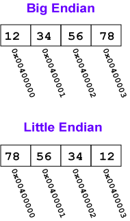

# Big Endian & Little Endian

## BIG_ENDIAN
 
 In this order, the bytes of a multibyte value are ordered from most significant to least significant.
 
 **Big Endian Byte Order:** The **most significant** byte (the "big end") of the data is placed at the byte with the lowest address. The rest of the data is placed in order in the next three bytes in memory.
 
## LITTLE_ENDIAN

 In this order, the bytes of a multibyte value are ordered from least significant to most significant.
 
 **Little Endian Byte Order:** The **least significant** byte (the "little end") of the data is placed at the byte with the lowest address. The rest of the data is placed in order in the next three bytes in memory.

 
 
## Java Code to determine Endianness

```java
import java.nio.ByteOrder;

public class Endian {
	public static void main(String argv[]) {
		ByteOrder b = ByteOrder.nativeOrder();
		if (b.equals(ByteOrder.BIG_ENDIAN)) {
			System.out.println("Big-endian");
		} else {
			System.out.println("Little-endian");
		}
		System.out.println(b);
	}
}
```
[Code](../Java/arbit/Endian.java)