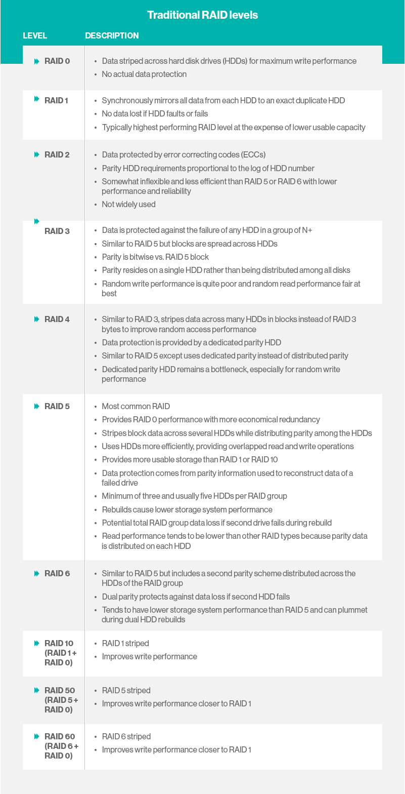

# Storage
---

## HDD

- Stores data on a series of constantly-spinning magnetic disks, called platters.

- Actuator arm with read/write heads positions the heads over the correct area of the drive to read/write (nanometers above platters).

- The drive may need to read from multiple locations in order to launch a program or load a file, which means it may have to wait for the platters to spin into the proper position multiple times before it can complete the command.

- If a drive is asleep or in a low-power state, it can take several seconds more for the disk to spin up to full power.

- Latency measured in milliseconds.

- SAS – Serial Attached SCSI – faster than HDD but still with a spinning platter.

---

## SSD (solid-state drive)

- Don't rely on moving parts or spinning disks.

- Data is saved to a pool of [NAND flash](http://whatis.techtarget.com/definition/NAND-flash-memory)  .

- NAND itself is made up of what are called floating gate transistors. Unlike the transistor designs used in DRAM, which must be refreshed multiple times per second, NAND flash is designed to retain its charge state even when not powered up.

- NAND flash is organized in a grid. The entire grid layout is referred to as a block, while the individual rows that make up the grid are called a page.

- Common page sizes are 2K, 4K, 8K, or 16K, with 128 to 256 pages per block.

- Block size therefore typically varies between 256KB and 4MB.

- Data read/written at the page level (individual rows within the grid).

- Data erased at the block level (requires a high amount of voltage).

- Latency measured in microseconds.

- SSD controllers have caches and a DDR3 memory pool to help with managing the NAND.

---

## RAID

RAID (redundant array of independent disks; originally redundant array of inexpensive disks) provides a way of storing the same data in different places (thus, redundantly) on multiple hard disks (though not all RAID levels provide redundancy). By placing data on multiple disks, input/output (I/O) operations can overlap in a balanced way, improving performance. Since multiple disks increase the mean time between failures (MTBF), storing data redundantly also increases fault tolerance.

RAID arrays appear to the operating system (OS) as a single logical hard disk. RAID employs the technique of **disk mirroring** or **disk striping**, which involves partitioning each drive's storage space into units ranging from a sector (512 bytes) up to several megabytes. The stripes of all the disks are interleaved and addressed in order.

### Disk striping

Disk striping is the process of dividing a body of data into blocks and spreading the data blocks across multiple storage devices, such as hard disks or solid-state drives (SSDs). A stripe consists of the data divided across the set of hard disks or SSDs, and a striped unit, or strip, that refers to the data slice on an individual drive.

**Pros and cons of disk striping**

The main advantage of disk striping is higher performance. For example, striping data across three hard disks would provide three times the bandwidth of a single drive. If each drive runs at 200 input/output operations per second (IOPS), disk striping would make available up to 600 IOPS for data reads and writes.

The disadvantage of disk striping is low resiliency. The failure of any physical drive in the striped disk set results in the loss of the data on the striped unit, and consequently, the loss of the entire data set stored across the set of striped hard disks.

### Disk mirroring

Disk mirroring, also known as RAID 1, is the replication of data to two or more disks. Disk mirroring is a good choice for applications that require high performance and high availability, such as transactional applications, email and operating systems.

Because both disks are operational, data can be read from them simultaneously, which makes read operations quite fast. Write operations, however, are slower because every write operation is done twice.

---

### Standard RAID levels

- **RAID 0:** This configuration has striping but no redundancy of data. It offers the best performance but no fault-tolerance.

- **RAID 1:** Also known as disk mirroring, this configuration consists of at least two drives that duplicate the storage of data. There is no striping. Read performance is improved since either disk can be read at the same time. Write performance is the same as for single disk storage.

- **RAID 2:** This configuration uses striping across disks with some disks storing error checking and correcting (ECC) information. It has no advantage over RAID 3 and is no longer used.

- **RAID 3:** This technique uses striping and dedicates one drive to storing parity information. The embedded ECC information is used to detect errors. Data recovery is accomplished by calculating the exclusive OR (XOR) of the information recorded on the other drives. Since an I/O operation addresses all drives at the same time, RAID 3 cannot overlap I/O. For this reason, RAID 3 is best for single-user systems with long record applications.

- **RAID 4:** This level uses large stripes, which means you can read records from any single drive. This allows you to use overlapped I/O for read operations. Since all write operations have to update the parity drive, no I/O overlapping is possible. RAID 4 offers no advantage over RAID 5.

- **RAID 5:** This level is based on block-level striping with parity. The parity information is striped across each drive, allowing the array to function even if one drive were to fail. The array’s architecture allows read and write operations to span multiple drives. This results in performance that is usually better than that of a single drive, but not as high as that of a RAID 0 array. RAID 5 requires at least three disks, but it is often recommended to use at least five disks for performance reasons.

	RAID 5 arrays are generally considered to be a poor choice for use on write-intensive systems because of the performance impact associated with writing parity information. When a disk does fail, it can take a long time to rebuild a RAID 5 array. Performance is usually degraded during the rebuild time and the array is vulnerable to an additional disk failure until the rebuild is complete.

- **RAID 6:** This technique is similar to RAID 5 but includes a second parity scheme that is distributed across the drives in the array. The use of additional parity allows the array to continue to function even if two disks fail simultaneously. However, this extra protection comes at a cost. RAID 6 arrays have a higher cost per gigabyte (GB) and often have slower write performance than RAID 5 arrays.

 

---