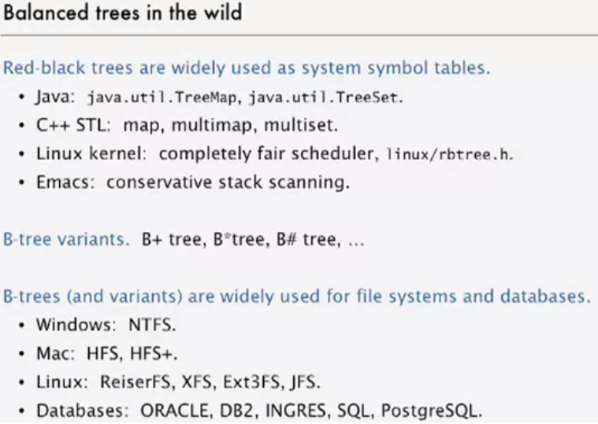

# Balanced Search Tree
---

A search-tree data structure for which a height of O(lg n) is guaranteed when implementing a dynamic set of n items. 

## 2-3 Trees

---

## Red-Black Trees

Red-black trees are an evolution of binary search trees that aim to keep the tree balanced without affecting the complexity of the primitive operations. This is done by coloring each node in the tree with either red or black and preserving a set of properties that guarantee that the deepest path in the tree is not longer than twice the shortest one.

A red-black tree is a binary search tree which has the following red-black properties:

- Every node is either red or black.

- (**root property**) The root of the red-black tree is black.

- (**red property**) The children of a red node are black. 
	( implies that on any path from the root to a leaf, red nodes must not be adjacent. However, any number of black nodes may appear in a sequence.)

- (**black property**) For each node with at least one null child, the number of black nodes on the path from the root to the null child is the same.

- Every leaf (NULL) is black.


### Insertion

1. If empty tree
	```java
	if (root == null){
		n.color = BLACK;
		root = n;
	}	
	```
	
2. Node and parent are both red. Uncle of node is red - push blackness down from grandparent. (Or make the grandparent red.).   If the grandparent is root make it black again.

3. Node and parent are both red. Node is left child, parent is left. Can fix extra redness with a single rotation (right).

4. Node and parent are both red. Node is right child, parent is right child. Can fix extra redness with a single rotation (left). Pass the redness to parent new left child and make parent black.

5. Node and parent are both red. Node is left child, parent is right child. - rotate. (Single rotate right). This will give rise to case 4.

	 
[Animation](https://www.cs.usfca.edu/~galles/visualization/RedBlack.html)


---

## AVL Tree

AVL tree is a self-balancing Binary Search Tree (BST) where the difference between heights of left and right subtrees cannot be more than one for all nodes. Most of the BST operations (e.g., search, max, min, insert, delete.. etc) take `O(h)` time where `h` is the height of the BST equal to `log n` - n is the number of nodes.

**Insertion**

To make sure that the given tree remains AVL after every insertion, we must augment the standard BST insert operation to perform some re-balancing. Two basic operations that can be performed to re-balance a BST without violating the BST property `(keys(left) < key(root) < keys(right))`. 

1. Left Rotation 
2. Right Rotation

*Steps to follow for insertion*

Let the newly inserted node be `w`

1. Perform standard BST insert for `w`.

2. Starting from `w`, travel up and find the first unbalanced node. Let `z` be the first unbalanced node, `y` be the child of `z` that comes on the path from `w` to `z` and `x` be the grandchild of `z` that comes on the path from `w` to `z`.

3. Re-balance the tree by performing appropriate rotations on the subtree rooted with `z`. There can be 4 possible cases that needs to be handled as `x`, `y` and `z` can be arranged in 4 ways. Following are the possible 4 arrangements:
	1. `y` is left child of `z` and `x` is left child of `y` (Left Left Case)
	2. `y` is left child of `z` and `x` is right child of `y` (Left Right Case)
	3. `y` is right child of `z` and `x` is right child of `y` (Right Right Case)
	4. `y` is right child of `z` and `x` is left child of `y` (Right Left Case)

Following are the operations to be performed in above mentioned 4 cases. In all of the cases, we only need to re-balance the subtree rooted with `z` and the complete tree becomes balanced as the height of subtree (After appropriate rotations) rooted with `z` becomes same as it was before insertion.

1. Left Left Case
```
T1, T2, T3 and T4 are subtrees.
         z                                      y 
        / \                                   /   \
       y   T4      Right Rotate (z)          x      z
      / \          - - - - - - - - ->      /  \    /  \ 
     x   T3                               T1  T2  T3  T4
    / \
  T1   T2
```  
  
  
2. Left Right Case
```
		 z                               z                           x
		/ \                            /   \                        /  \ 
	   y   T4  Left Rotate (y)        x    T4  Right Rotate(z)    y      z
	  / \      - - - - - - - - ->    /  \      - - - - - - - ->  / \    / \
	T1   x                          y    T3                    T1  T2 T3  T4
		/ \                        / \
	  T2   T3                    T1   T2
```
  
3. Right Right Case
```
		  z                                y
		 /  \                            /   \ 
		T1   y     Left Rotate(z)       z      x
			/  \   - - - - - - - ->    / \    / \
		   T2   x                     T1  T2 T3  T4
			   / \
			 T3  T4
```
	 
4. Right Left Case
```
		   z                            z                            x
		  / \                          / \                          /  \ 
		T1   y   Right Rotate (y)    T1   x      Left Rotate(z)   z      y
			/ \  - - - - - - - - ->     /  \   - - - - - - - ->  / \    / \
		   x   T4                      T2   y                  T1  T2  T3  T4
		  / \                              /  \
		T2   T3                           T3   T4
```

[AVL Tree Code](./Tree/balanced_tree/AVLTree.java)

**Time Complexity:** The rotation operations (left and right rotate) take constant time as only few pointers are being changed there. Updating the height and getting the balance factor also take constant time. So the time complexity of AVL insert remains same as BST insert which is O(h) where h is height of the tree. Since AVL tree is balanced, the height is O(Logn). So time complexity of AVL insert is O(Logn).

**Comparison with Red Black Tree:** The AVL trees are more balanced compared to Red Black Trees, but they may cause more rotations during insertion and deletion. So if your application involves many frequent insertions and deletions, then Red Black trees should be preferred. And if the insertions and deletions are less frequent and search is more frequent operation, then AVL tree should be preferred over Red Black Tree.

**Deletion**

To make sure that the given tree remains AVL after every deletion, we must augment the standard BST delete operation to perform some re-balancing. Two basic operations that can be performed to re-balance a BST without violating the BST property `(keys(left) < key(root) < keys(right))`. 

1. Left Rotation 
2. Right Rotation 

```
T1, T2 and T3 are subtrees of the tree rooted with y (on left side)
or x (on right side)
                y                               x
               / \     Right Rotation          /  \
              x   T3   – – – – – – – >        T1   y
             / \       < - - - - - - -            / \
            T1  T2     Left Rotation            T2  T3
Keys in both of the above trees follow the following order
      keys(T1) < key(x) < keys(T2) < key(y) < keys(T3)
So BST property is not violated anywhere.
```

Let `w` be the node to be deleted

1. Perform standard BST delete for `w`.

2. Starting from `w`, travel up and find the first unbalanced node. Let `z` be the first unbalanced node, `y` be the larger height child of `z`, and `x` be the larger height child of `y`.

3. Re-balance the tree by performing appropriate rotations on the subtree rooted with `z`. There can be 4 possible cases that needs to be handled as `x`, `y` and `z` can be arranged in 4 ways. Following are the possible 4 arrangements:
	1. `y` is left child of `z` and `x` is left child of `y` (Left Left Case)
	2. `y` is left child of `z` and `x` is right child of `y` (Left Right Case)
	3. `y` is right child of `z` and `x` is right child of `y` (Right Right Case)
	4. `y` is right child of `z` and `x` is left child of `y` (Right Left Case)
	
Like insertion, following are the operations to be performed in above mentioned 4 cases. Note that, **unlike insertion, fixing the node `z` won’t fix the complete AVL tree. After fixing `z`, we may have to fix ancestors of z as well.**

1. Left Left Case - Right Rotate(z)
2. Left Right Case - Left Rotate (y) -> Right Rotate(z) 
3. Right Right Case - Left Rotate(z)
4. Right Left Case - Right Rotate (y) -> Left Rotate(z) 	
	
Unlike insertion, in deletion, after we perform a rotation at `z`, we may have to perform a rotation at ancestors of `z`. Thus, we must continue to trace the path until we reach the root.

	
	
	
	
	
	
	
---

## B-Trees



---
