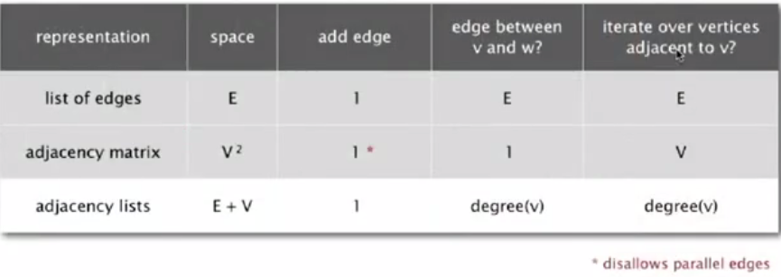
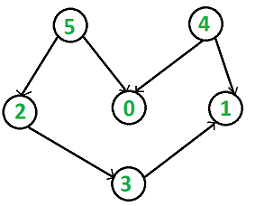
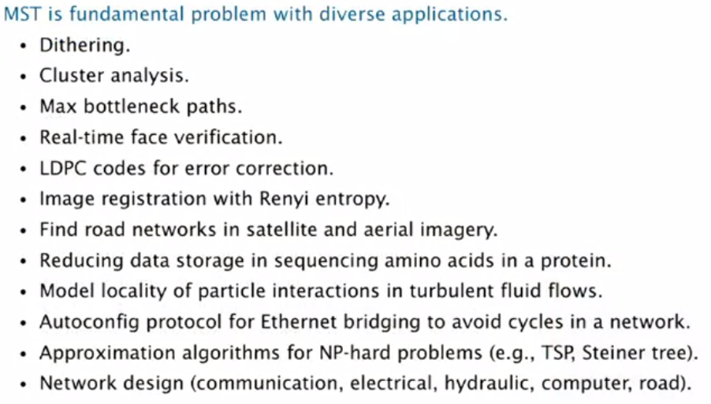

# Graph
---


Graph is a data structure that consists of following two components:
1. A finite set of vertices also called as nodes.
2. A finite set of ordered pair of the form (u, v) called as edge. The pair is ordered because (u, v) is not same as (v, u) in case of directed graph(di-graph). The pair of form (u, v) indicates that there is an edge from vertex u to vertex v. The edges may contain weight/value/cost.

**Real life applications:**

Networks: telephone, circuits, social (e.g. LinkedIn, Facebook)

neural network -  vertex: neuron , edge: synapse 

---

## Representations of graphs

1. Adjacency Matrix
2. Adjacency List

There are other representations also like, **Incidence Matrix** and **Incidence List**. The choice of the graph representation is situation specific.

**Adjacency Matrix:**

Adjacency Matrix is a 2D array of size **V x V** where **V** is the number of vertices in a graph. Let the 2D array be `adj[][]`, a slot `adj[i][j] = 1` indicates that there is an edge from vertex i to vertex j. Adjacency matrix for undirected graph is always symmetric. Adjacency Matrix is also used to represent weighted graphs. If `adj[i][j] = w`, then there is an edge from vertex i to vertex j with weight w.


**Pros:** Representation is easier to implement and follow. Removing an edge takes O(1) time. Queries like whether there is an edge from vertex `u` to vertex `v` are efficient and can be done O(1).

**Cons:** Consumes more space O(V<sup>2</sup>). Even if the graph is sparse(contains less number of edges), it consumes the same space. Adding a vertex is O(V<sup>2</sup>) time.


**Adjacency List**

An array of linked lists is used. Size of the array is equal to number of vertices. Let the array be `array[]`. An entry `array[i]` represents the linked list of vertices adjacent to the i<sup>th</sup> vertex. This representation can also be used to represent a weighted graph. The weights of edges can be stored in nodes of linked lists.


### Space and Time comparision

	

---

## Breadth-first search

Visit all the adjacent vertex before proceeding further. Put unvisited vertices on a queue.

```java
public void bfs(int s) {
		boolean[] visited = new boolean[v];

		Queue<Integer> q = new LinkedList<Integer>();
		visited[s] = true;
		q.offer(s);

		while (!q.isEmpty()) {
			Integer ns = q.poll();

			System.out.println(ns + " ");

			Iterator<Integer> it = adjList[ns].listIterator();

			while (it.hasNext()) {
				int n = it.next();
				if (!visited[n]) {
					visited[n] = true;
					q.offer(n);
				}
			}
		}

	}
```

### Applications of Breadth First Search

- **GPS Navigation systems:** Breadth First Search is used to find all neighboring locations.
- **Peer to Peer Networks.** In Peer to Peer Networks like BitTorrent, Breadth First Search is used to find all neighbor nodes.

---

## Depth-first search

Use stack for iterative approach or recursion.

Recursive approach:
```java
public void dfsRecursive(int source) {
		boolean[] marked = new boolean[v];
		int[] edgeTo = new int[v];

		dfsRecursiveMain(source, marked, edgeTo);
	}

	public void dfsRecursiveMain(int s, boolean[] marked, int[] edgeTo) {
		marked[s] = true;
		for (int w : adjList[s]) {
			if (!marked[w]) {
				dfsRecursiveMain(w, marked, edgeTo);
				edgeTo[w] = s;
			}
		}
	}
```

Iterative approach:
```java
public void dfs(int source) {
		boolean[] visited = new boolean[v];

		Stack<Integer> s = new Stack<Integer>();
		visited[source] = true;
		s.push(source);

		while (!s.isEmpty()) {
			Integer ns = s.pop();

			System.out.println(ns + " ");

			Iterator<Integer> it = adjList[ns].descendingIterator();

			while (it.hasNext()) {
				int n = it.next();
				if (!visited[n]) {
					visited[n] = true;
					s.push(n);
				}
			}
		}
	}
```


**Application of DFS** :

- [Detect a cycle in an undirected graph.](./Graph/Cycle_Detection/CycleDetectionDFS.java)  
	
**Iterative approach**

```java
public static boolean detectCycle(AdjListGraph g, int source) {
		boolean[] visited = new boolean[g.getVertices()];
		int[] edgeFrom = new int[g.getVertices()]; 

		Set<Integer> visitedSet = new HashSet<>();
		Stack<Integer> s = new Stack<>();
		
		s.push(source);
		
		while (!s.isEmpty()) {
			int current = s.pop();
			visitedSet.add(current);
			Iterator<Integer> it = g.getAdjList()[current].descendingIterator();

			while (it.hasNext()) {
				int n = it.next();
				if (!visitedSet.contains(n)) {					
					s.push(n);
					edgeFrom[n] = current;
				} else if (n != edgeFrom[current]) {
					return true;
				}
			}
		}
		return false;
	}
```

---

## Directed Graphs or Digraph

Set of vertices connected pairwise by **directed** edges.

- Digraph Search
	
	### Reachability application: program control-flow analysis
		
	- **Every program is a digraph**	
		- Vertex = basic block of instructions(straight line program)
		- Edge = jump
		
	- **Dead-code elimination**
		Find (and remove) unreachable code
		
	- **Infinite loop detection**
		Determine whether exit is unreachable
	
	**Mark-sweep garbage collector** - Use DFS on diagraph to find reachable objects and the free the memory of unreachable ones.

	BFS in diagraph application : web crawler

- When DFS is applied over a directed and connected graph, it will yield a tree. If the tree contains a back edge, we can say that the graph has a cycle present. A back edge is an edge that is from a node to itself (selfloop) or to one of its ancestor in the tree produced by DFS. 	

- To detect a back edge, we can keep track of vertices currently in recursion stack of function for DFS traversal.  If we reach a vertex that is already in the recursion stack, then there is a cycle in the tree. The edge that connects current vertex to the vertex in the recursion stack is back edge.  We have used `recStack[]` array to keep track of vertices in the recursion stack.

**Cycle Detection in Directed Graph**
	
```java
	public boolean detectCycle() {

		boolean[] visited = new boolean[v];
		boolean[] recStack = new boolean[v];

		for (int i = 0; i < v; i++) {
			if (detectCycleHelper(visited, recStack, i)) {
				return true;
			}
		}
		return false;
	}

	public boolean detectCycleHelper(boolean[] visited, boolean[] recStack, int source) {

		if (!visited[source]) {
			visited[source] = true;
			recStack[source] = true;
			Iterator<Integer> it = adjList[source].iterator();

			while (it.hasNext()) {
				int n = it.next();
				if (!visited[n] && detectCycleHelper(visited, recStack, n)) {
					return true;
				} else if (recStack[n]) {
					return true;
				}
			}
		}
		recStack[source] = false;
		return false;
	}
```	
	
---	

## Topological Sort

Order of things which should be done before one another.

Topological sorting for Directed Acyclic Graph (DAG) is a linear ordering of vertices such that for every directed edge `u -> v`, vertex `u` comes before `v` in the ordering. Topological Sorting for a graph is not possible if the graph is not a DAG.

a topological sorting of the following graph is “5 4 2 3 1 0”. There can be more than one topological sorting for a graph. For example, another topological sorting of the following graph is “4 5 2 3 1 0”. The first vertex in topological sorting is always a vertex with in-degree as 0 (a vertex with no in-coming edges).



**DAG: Directed Acyclic Graph**

- If directed cycle, topological order impossible.
- If no directed cycle, DFS-based algorithm finds a topological order.
- A DAG G has at least one vertex with in-degree 0 and one vertex with out-degree 0.

**Directed cyclic detection application:** cyclic inheritance

Java compiler does cyclic detection. If class A extends class B, class B extends class C and class C extends class A; there is a error of cyclic inheritance.

In topological sorting, we need to print a vertex before its adjacent vertices. Use a temporary stack. Perform the DFS operation and rather than outputting the vertex, store it in a stack. After DFS for all the elements have been finished pop the stack. The order would be topologically sorted.

	

```java
void topologicalSortHelper(int v, boolean[] marked, Stack<Integer> s) {

		marked[v] = true;

		for (int i : adjList[v]) {
			if (!marked[i]) {
				topologicalSortHelper(i, marked, s);
			}
		}
		s.push(v);
	}

public void topologicalSort() {
		Stack<Integer> op = new Stack<Integer>();
		boolean[] marked = new boolean[v];

		for (int i = 0; i < v; i++) {
			if (!marked[i]) {
				topologicalSortHelper(i, marked, op);
			}
		}

		while (!op.isEmpty()){
			System.out.print(op.pop() + " ");
		}
	}
```	

Topological Sorting is mainly used for scheduling jobs from the given dependencies among jobs. 

Kahn's Algorithm for finding the topological ordering of a DAG:

Step-1: Compute in-degree (number of incoming edges) for each of the vertex present in the DAG and initialize the count of visited nodes as 0.

Step-2: Pick all the vertices with in-degree as 0 and add them into a queue (Enqueue operation)

Step-3: Remove a vertex from the queue (Dequeue operation) and then.

Increment count of visited nodes by 1.
Decrease in-degree by 1 for all its neighboring nodes.
If in-degree of a neighboring nodes is reduced to zero, then add it to the queue.

Step 4: Repeat Step 3 until the queue is empty.

Step 5: If count of visited nodes is not equal to the number of nodes in the graph then the topological sort is not possible for the given graph.

---

## Minimum Spanning Tree

A spanning tree of graph G is subgraph T that is both a **tree**(connected and acyclic) and **spanning**(includes all the vertices). The goal is to find a minimum weight spanning tree. A minimum spanning tree has `(V – 1)` edges where `V` is the number of vertices in the given graph.



**Cut property**

A cut in a graph is a partition of its vertices into two (non empty sets)


### Kruskal's algorithm

1. Sort all the edges in non-decreasing order of their weight.

2. Pick the smallest edge. Check if it forms a cycle with the spanning tree 
formed so far. If cycle is not formed, include this edge. Else, discard it.  

3. Repeat step#2 until there are (V-1) edges in the spanning tree.

Kruskal's algorithm computes MST in time proportional to `E logE` (in the worst case time).

[Kruskal's MST Code](./Graph/Minimum_Spanning_Tree/KruskalMST.java)

---

### Prim's algorithm

1. Start with vertex 0 and greedily grow tree T.

2. Add to T the min weight edge with exactly one endpoint in T.

3. Repeat until V-1 edges.

[Lazy Prim's algorithm code](./Minimum_Spanning_Tree/LazyPrimMST.java)

Lazy Prim's algorithm computes the MST in time proportional to `E log E` and extra space proportional to `E`(in the worst case).
	
---

## Strongly-connected components

Vertices v and w are **strongly connected** if there is a directed path from v to w and a directed path from w to v. Strong connectivity is an equivalence relation.


---

## Shortest Path


---

## Maximum Flow


---
		
## Graph Problems

- Minimize Cash Flow among a given set of friends who have borrowed money from each other. [Link](http://www.geeksforgeeks.org/minimize-cash-flow-among-given-set-friends-borrowed-money/)
	
- 	