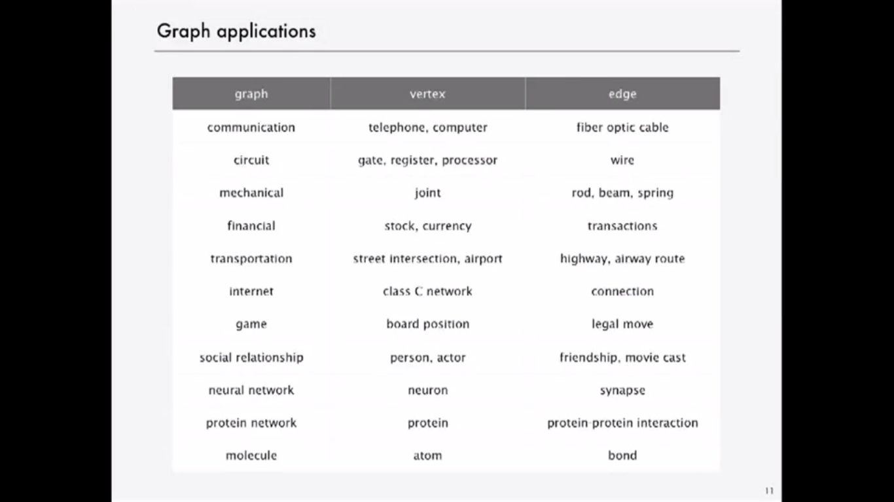
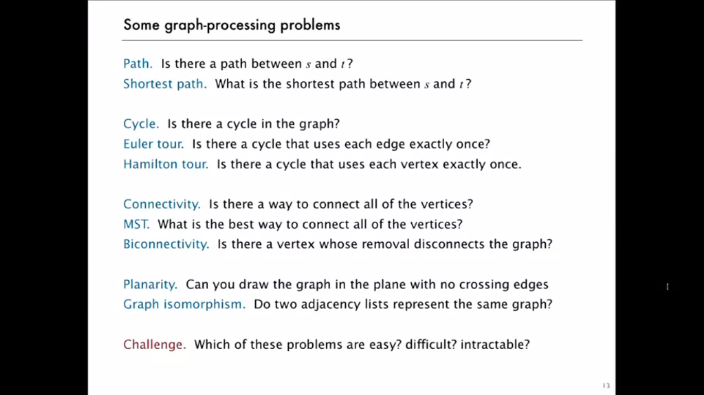

# Graph
---


Graph is a data structure that consists of following two components:
1. A finite set of vertices also called as nodes.
2. A finite set of ordered pair of the form (u, v) called as edge. The pair is ordered because (u, v) is not same as (v, u) in case of directed graph(di-graph). The pair of form (u, v) indicates that there is an edge from vertex u to vertex v. The edges may contain weight/value/cost.

**Real life applications:**

Networks: telephone, circuits, social (e.g. LinkedIn, Facebook)



---



## Representations of graphs

1. Adjacency Matrix
2. Adjacency List

There are other representations also like, **Incidence Matrix** and **Incidence List**. The choice of the graph representation is situation specific.

**Adjacency Matrix:**

Adjacency Matrix is a 2D array of size **V x V** where **V** is the number of vertices in a graph. Let the 2D array be `adj[][]`, a slot `adj[i][j] = 1` indicates that there is an edge from vertex i to vertex j. Adjacency matrix for undirected graph is always symmetric. Adjacency Matrix is also used to represent weighted graphs. If `adj[i][j] = w`, then there is an edge from vertex i to vertex j with weight w.


**Pros:** Representation is easier to implement and follow. Removing an edge takes O(1) time. Queries like whether there is an edge from vertex `u` to vertex `v` are efficient and can be done O(1).

**Cons:** Consumes more space O(V<sup>2</sup>). Even if the graph is sparse(contains less number of edges), it consumes the same space. Adding a vertex is O(V<sup>2</sup>) time.


**Adjacency List**

An array of linked lists is used. Size of the array is equal to number of vertices. Let the array be `array[]`. An entry `array[i]` represents the linked list of vertices adjacent to the i<sup>th</sup> vertex. This representation can also be used to represent a weighted graph. The weights of edges can be stored in nodes of linked lists.


### Space and Time comparision

	

---

## Breadth-first search

Visit all the adjacent vertex before proceeding further.Put unvisited vertices on a queue.

```java
public void bfs(int s) {
		boolean[] visited = new boolean[v];

		Queue<Integer> q = new LinkedList<Integer>();
		visited[s] = true;
		q.offer(s);

		while (!q.isEmpty()) {
			Integer ns = q.poll();

			System.out.println(ns + " ");

			Iterator<Integer> it = adjList[ns].listIterator();

			while (it.hasNext()) {
				int n = it.next();
				if (!visited[n]) {
					visited[n] = true;
					q.offer(n);
				}
			}
		}

	}
```

### Applications of Breadth First Search

- **GPS Navigation systems:** Breadth First Search is used to find all neighboring locations.
- **Peer to Peer Networks.** In Peer to Peer Networks like BitTorrent, Breadth First Search is used to find all neighbor nodes.

---

## Depth-first search

Use stack for iterative approach or recursion.

Recursive approach:
```java
public void dfsRecursive(int source) {
		boolean[] marked = new boolean[v];
		int[] edgeTo = new int[v];

		dfsRecursiveMain(source, marked, edgeTo);
	}

	public void dfsRecursiveMain(int s, boolean[] marked, int[] edgeTo) {
		marked[s] = true;
		for (int w : adjList[s]) {
			if (!marked[w]) {
				dfsRecursiveMain(w, marked, edgeTo);
				edgeTo[w] = s;
			}
		}
	}
```

Iterative approach:
```java
public void dfs(int source) {
		boolean[] visited = new boolean[v];

		Stack<Integer> s = new Stack<Integer>();
		visited[source] = true;
		s.push(source);

		while (!s.isEmpty()) {
			Integer ns = s.pop();

			System.out.println(ns + " ");

			Iterator<Integer> it = adjList[ns].descendingIterator();

			while (it.hasNext()) {
				int n = it.next();
				if (!visited[n]) {
					visited[n] = true;
					s.push(n);
				}
			}
		}
	}
```


**Application of DFS** :

- Detect a cycle in a graph.

---

## Directed Graphs or Digraph

Set of vertices connected pairwise by **directed** edges.

- Digraph Search
	
	### Reachability application: program control-flow analysis
		
	- **Every program is a digraph**	
		- Vertex = basic block of instructions(straight line program)
		- Edge = jump
		
	- **Dead-code elimination**
		Find (and remove) unreachable code
		
	- **Infinite loop detection**
		Determine whether exit is unreachable
	
	**Mark-sweep garbage collector** - Use DFS on diagraph to find reachable objects and the free the memory of unreachable ones.

	BFS in diagraph application : web crawler

---	

## Topological Sort

Order of things which should be done before one another.

**DAG: Directed Acyclic Graph**

- If directed cycle, topological order impossible.
- If no directed cycle, DFS-based algorithm finds a topological order.

DFS can be used to detect a cycle in a graph: Write code??

**Directed cyclic detection application:** cyclic inheritance

Java compiler does cyclic detection. If class A extends class B, class B extends class C and class C extends class A; there is a error of cyclic inheritance.

In topological sorting, we need to print a vertex before its adjacent vertices. Use a temporary stack. Perform the DFS operation and rather than outputting the vertex, store it in a stack. After DFS for all the elements have been finished pop the stack. The order would be topologically sorted.

	

```java
void topologicalSortHelper(int v, boolean[] marked, Stack<Integer> s) {

		marked[v] = true;

		for (int i : adjList[v]) {
			if (!marked[i]) {
				topologicalSortHelper(i, marked, s);
			}
		}
		s.push(v);
	}

public void topologicalSort() {
		Stack<Integer> op = new Stack<Integer>();
		boolean[] marked = new boolean[v];

		for (int i = 0; i < v; i++) {
			if (!marked[i]) {
				topologicalSortHelper(i, marked, op);
			}
		}

		while (!op.isEmpty()){
			System.out.print(op.pop() + " ");
		}
	}
```	
	
---

## Strongly-connected components

Vertices v and w are **strongly connected** if there is a directed path from v to w and a directed path from w to v. Strong connectivity is an equivalence relation.

---

## Union-Find


---

## Minimum Spanning Tree

A spanning tree of graph G is subgraph T that is both a **tree**(connected and acyclic) and **spanning**(includes all the vertices). The goal is to find a minimum weight spanning tree. A minimum spanning tree has (V – 1) edges where V is the number of vertices in the given graph.


### Kruskal's algorithm

1. Sort all the edges in non-decreasing order of their weight.

2. Pick the smallest edge. Check if it forms a cycle with the spanning tree 
formed so far. If cycle is not formed, include this edge. Else, discard it.  

3. Repeat step#2 until there are (V-1) edges in the spanning tree.


---

### Prim's algorithm


---

## Shortest Path


---

## Maximum Flow


---

## Graph processing Challenges

- Is the graph bipartite?
	- Simple DFS based solution would do it.

- Find a cycle in graph.
	- **Euler cycle** : Is there a cycle that uses each edge exactly once.
		A connected graph is Eulerian iff all vertices have even degree.out
		
	- ** Hamiltonion Cycle**: Find a cycle that visits every vertex exactly once. (Travelling salesman problem)	Classic NP-complete problem.

- Are two graphs identical? Graph Isomorphism. No one knows.	
	
- Lay out a graph in the plane without crossing edges?
	- linear time DFS-based planarity Algorithm (Tarjan)
	
	
## [Graph Problems](http://www.geeksforgeeks.org/graph-data-structure-and-algorithms/)