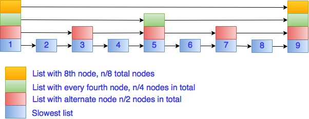

# Skip List

Skip list starts with goal in mind that how to make search more efficient in list. In typical linked list, to search an item, we need to scan through all nodes of list before the it. This makes complexity of search on list O(N). Idea is can we skip lot of nodes before node which is to be searched is located. That leads to hierarchy of sorted linked lists.

Skip list is a data structure which can be considered as generalization of singly linked lists. Like in singly linked list, insertion and removal are simple and on top of that, search or retrieval in skip lists is also very efficient as compared to singly linked list.




**Comparison chart of complexity of various operations on skip list and normal list**

```
Operation            Normal list                  Skip list
Insertion            O(N) at end                  O(log N)
                     O(1) at front
Deletion             O(N)                         O(log N)
Retrieval            O(N)                         O(log N)
Ordered traversal    O(N)                         O(N)
```

This makes skip list a very useful data structure. **skip list can be used as the underlying storage for a sorted set data structure.** But, skip list can be directly used to implement some operations that are not efficient on a typical sorted set:

- Find the element in the set that is closest to some given value, in `O(log N)` time.

- Find the k<sup>th</sup> largest element in the set, in `O(log N)` time. Requires a simple  augmentation of the the skip list with partial counts.

- Count the number of elements in the set whose values fall into a given range, in `O(log N)` time. Also requires a simple augmentation of the skip list.

