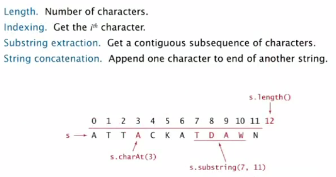
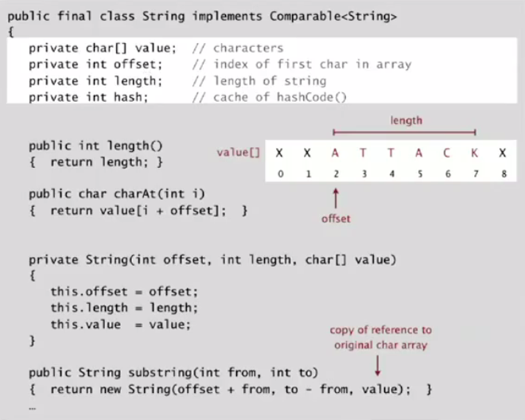
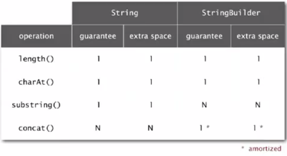
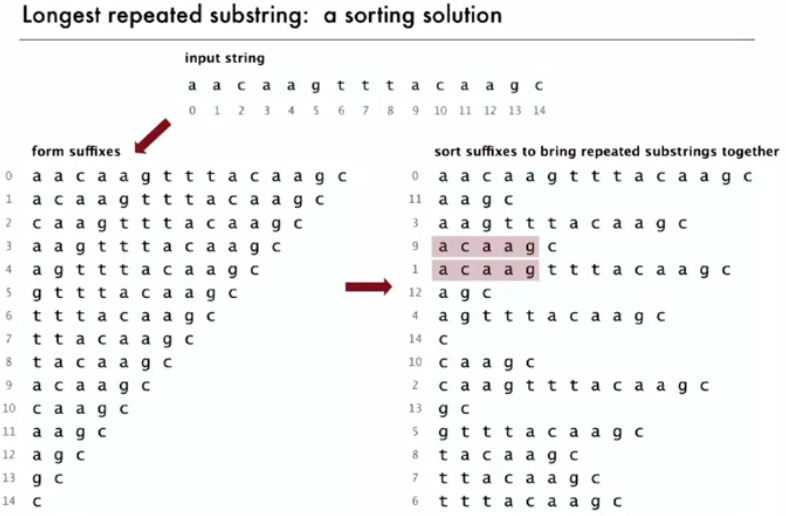
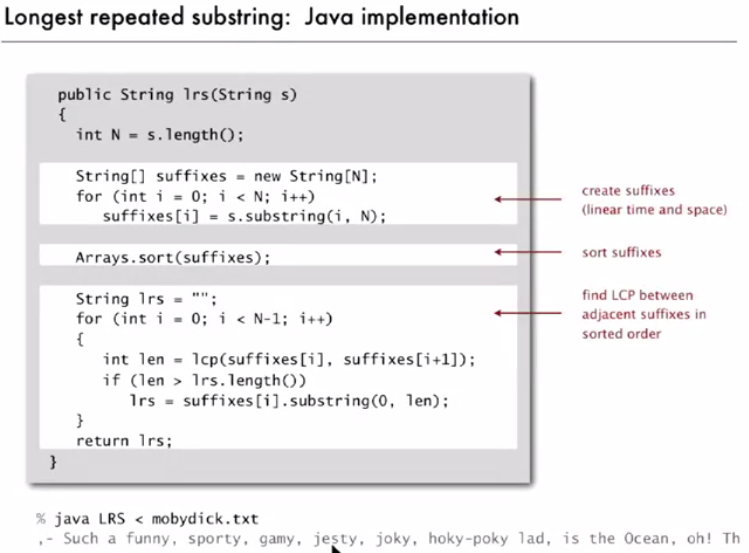
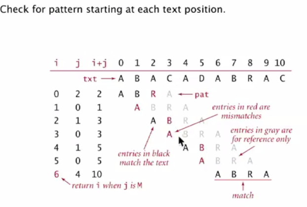
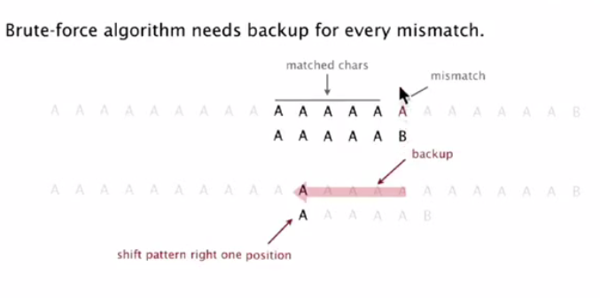

# String 
---

Sequence of characters.

## The `char` data type

**C char data type**. Typically an 8-bit integer
- Supports 7-bit ASCII.
- Can represent only 256 chracters.

**Java char data type.** A 16-bit unsigned integer.
- Supports original 16-bit Unicode.

---

## String data type in Java

Sequence of characters **(immutable)**.



**Underlying Implementation** - Immutable char[] array, offset, and length.

- Substring operation can be done in constant time.

- Java caches the hashcode() method in String thorugh a `private int hash` variable.

### Java Implementation




---

## StringBuilder data type

Sequence of characters (mutable).

**Underlying Implementation** - Resizing char[] array and length.

Why substring method in StringBuilder takes quadratic time.

Substring in StringBuilder creates a new Object copying each character while String copies the reference to the original array adjusting the offset and count variables. 



---

## Alphabets


---

## Longest repeated substring





---

## Substring Search
---

### Brute-Force Substring search



```java
public static int bruteForceSubstringSearch(String text, String pat) {

		int N = text.length();
		int M = pat.length();

		for (int i = 0; i < N - M; i++) {

			int j ;
			for (j = 0 ; j < M; j++) {
				if(text.charAt(i+j) != pat.charAt(j)){
					break;
				}
			}
			if(j==M){
				return i;
			}
		}
		return -1;
	}
```

- Java `indexOf` uses the above algorithm

**Issues with Brute Force**




---

### Knuth-Morris-Pratt


