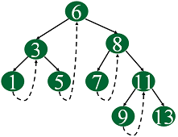

 
# Trees 
Unlike Array and Linked List, which are linear data structures, tree is hierarchical (or non-linear) data structure.  

Saying that the structure of a tree is hierarchical means that things are ordered above or below other things. For example, the army is hierarchical, with generals above colonels, and colonels above lieutenants, etc.
  
- If we organize keys in form of a tree (with some ordering e.g., BST), we can search for a given key in moderate time (quicker than Linked List and slower than arrays). **Self-balancing search trees like AVL and Red-Black trees guarantee an upper bound of O(Logn) for search.**

- We can insert/delete keys in moderate time (quicker than Arrays and slower than Unordered Linked Lists). **Self-balancing search trees like AVL and Red-Black trees guarantee an upper bound of O(Logn) for insertion/deletion.**


## Binary Tree
In Binary Tree each node has zero child, one child or two children.

***Strict Binary Tree***:
If each node has exactly two children or no children.

___Full Binary Tree___: 
If each node has exactly two children and all leaf nodes are at same level.	

***Complete Binary Tree***: A Binary Tree is complete Binary Tree if all levels are completely filled except possibly the last level and the last level has all keys as left as possible.
If all leaf nodes are at height `h` or `h-1` and also without any missing number of sequence. 

```
               18
           /       \  
         15         30  
        /  \        /  \
      40    50    100   40
	  
               18
           /       \  
         15         30  
        /  \        /  \
      40    50    100   40
     /  \   /
    8   7  9 	  
	  
```
	
The depth of a node n is the number of nodes on the search path from the root to n,
not including n itself. The height of a binary tree is the maximum depth of any node
in that tree.	
	
	
## Binary tree implementation
```java
public class BinaryTree {

	public BTNode root;

	static class BTNode {
		public int data;
		public BTNode left;
		public BTNode right;

		public BTNode(int data) {
			this.data = data;
			left =  null;
			right = null;
		}
	}

	public BinaryTree(BTNode root) {
		this.root = root;
	}
}	
```	

## Why Trees?

- Trees (with some ordering e.g., BST) provide moderate access/search (quicker than Linked List and slower than arrays).
- Trees provide moderate insertion/deletion (quicker than Arrays and slower than Unordered Linked Lists).

## Tree applications

- Manipulate hierarchical data.
- Router algorithms.

## Tree Properties

- The maximum number of nodes at level `l` of a binary tree is 2<sup>(l-1)</sup>. (Assuming root is at level 1)

- Maximum number of nodes in a binary tree of height **h** is **2<sup>h</sup> – 1**.

- In a Binary Tree with N nodes, minimum possible height or minimum number of levels is  Log(N+1)

- A Binary Tree with L leaves has at least   LogL + 1   levels 

# Diameter of a Binary Tree

The diameter of a tree (sometimes called the width) is the number of nodes on the longest path between two leaves in the tree. The diameter of a tree T is the largest of the following quantities:

- the diameter of T’s left subtree
- the diameter of T’s right subtree
- the longest path between leaves that goes through the root of T (this can be computed from the heights of the subtrees of T)

```java
/*The function Compute the "height" of a tree. Height is the
	 number f nodes along the longest path from the root node
	 down to the farthest leaf node.*/
	static int height(BTNode node) {
		/* base case tree is empty */
		if (node == null)
			return 0;

		/* If tree is not empty then height = 1 + max of left
		   height and right heights */
		return (1 + Math.max(height(node.left), height(node.right)));
	}

	/* Method to calculate the diameter and return it to main */
	int diameter(BTNode root) {
		/* base case if tree is empty */
		if (root == null)
			return 0;

		/* get the height of left and right sub trees */
		int lheight = height(root.left);
		int rheight = height(root.right);

		/* get the diameter of left and right subtrees */
		int ldiameter = diameter(root.left);
		int rdiameter = diameter(root.right);

		/* Return max of following three
		  1) Diameter of left subtree
		 2) Diameter of right subtree
		 3) Height of left subtree + height of right subtree + 1 */
		return Math.max(lheight + rheight + 1, Math.max(ldiameter, rdiameter));

	}

```

---

# Threaded Binary Tree

The idea of threaded binary trees is to make inorder traversal faster and do it without stack and without recursion. A binary tree is made threaded by making all right child pointers that would normally be NULL point to the inorder successor of the node (if it exists).

There are two types of threaded binary trees.

**Single Threaded:** Where a NULL right pointers is made to point to the inorder successor (if successor exists).

**Double Threaded:** Where both left and right NULL pointers are made to point to inorder predecessor and inorder successor respectively. The predecessor threads are useful for reverse inorder traversal and postorder traversal.



---

## Tree problems tips

- **Bottom view or Vertical print**: Find the horizontal distance of each node. Mark the horizontal distance (hd) of root as zero and then recursively mark the hd of left and right child -1 and +1 respectively to their parent. Sort elements based on hd.

- **mirror check**: Recursively check left child of first root with right child of second root.

- Tree construction from inorder and post/pre order can be done by divide and conquer. take element from pre/post and search the same in inorder and divide the left and right elements recursively

- Min/Max Depth - if root is null then it is 0 other wise it is the minimum of its left and right subtrees. Check this recursively.

- [Print root to leaves path](./Tree/Problems/PrintRootToLeafPath.java)


---

# Problems

- Write a Program to Find the Maximum Depth or Height of a Tree

	```java
	int maxDepth(Node node) 
    {
        if (node == null)
            return 0;
        else
        {
            /* compute the depth of each subtree */
            int lDepth = maxDepth(node.left);
            int rDepth = maxDepth(node.right);
  
            /* use the larger one */
            if (lDepth > rDepth)
                return (lDepth + 1);
             else
                return (rDepth + 1);
        }
    }
	```

- If you are given two traversal sequences, can you construct the binary tree?
	
	It depends on what traversals are given. If one of the traversal methods is Inorder then the tree can be constructed, otherwise not.

- Print Ancestors of a given node in Binary Tree. [code](./Tree/Problems/PrintAncestors.java)

```java
public boolean printAncestorsFunc(BinaryTree.BTNode root, BinaryTree.BTNode target) {

		if (root == null) {
			return false;
		}

		if(root == target){
			return true;
		}

		if (printAncestorsFunc(root.left, target) || printAncestorsFunc(root.right, target)) {
			System.out.print(root.data + " ");
			return true;
		}

		return false;
	}
```	

- Given two binary trees, check whether two trees are identical or not. Write working code for it.

```java
/* Given two trees, return true if they are
       structurally identical */
    boolean identicalTrees(Node a, Node b) 
    {
        /*1. both empty */
        if (a == null && b == null)
            return true;
             
        /* 2. both non-empty -> compare them */
        if (a != null && b != null) 
            return (a.data == b.data
                    && identicalTrees(a.left, b.left)
                    && identicalTrees(a.right, b.right));
  
        /* 3. one empty, one not -> false */
        return false;
    }
```

- check whether one tree is subtree of another or not
	
- **[Convert a Binary tree to DLL.](http://www.geeksforgeeks.org/convert-a-given-binary-tree-to-doubly-linked-list-set-4/)**

- Spiral Print of Tree.

- Linked List to Binary Tree conversion.

- Print Right View of a Binary Tree.
Given a Binary Tree, print Right view of it. Right view of a Binary Tree is set of nodes visible when tree is visited from Right side.

```java
class MaxLevelSofar{
		int maxlevelSoFar;
	}

	public void getRightView2Util(BTNode root, int level, MaxLevelSofar mxl) {

		if (root == null) {
			return ;
		}

		if ( mxl.maxlevelSoFar < level ) {
			System.out.print(root.data + " ");
			mxl.maxlevelSoFar = level;
		}

		getRightView2Util(root.right, level + 1, mxl);
		getRightView2Util(root.left, level + 1, mxl);
	}

	public void getRightView2(BTNode root) {
		MaxLevelSofar mxl = new MaxLevelSofar();
		getRightView2Util(root, 1, mxl);
	}
```

-  calculating the height in the same recursion rather than calling a height() function separately. (http://www.geeksforgeeks.org/how-to-determine-if-a-binary-tree-is-balanced/)

- Write a function that returns true if the given Binary Tree is SumTree else false. SumTree is a Binary Tree where the value of a node is equal to sum of the nodes present in its left subtree and right subtree.

