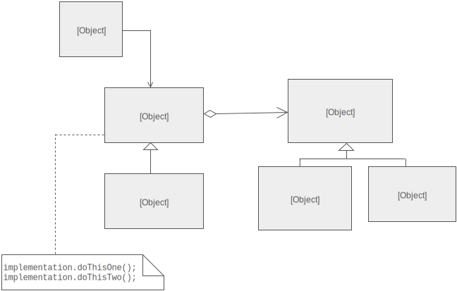
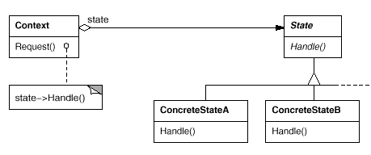
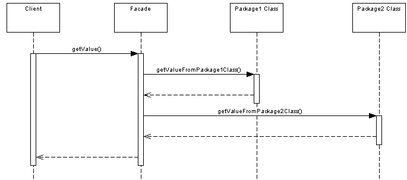
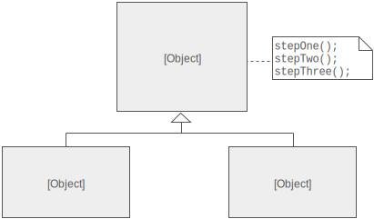

# Design Patterns
---


# Creational
---

## Singleton

Only single instance of object is created. On further requests same object is being returned.

[Singleton](./Singleton/Singleton.java)

To avoid creation of object through cloning override the `clone()` method and throw `CloneNotSupportedException`.

[Thread Safe Singleton](./Singleton/ThreadSingleton.java)

Double null check is required in Thread Safe Singleton design.

**Early instantiation using implementation with static field**

```java
//Early instantiation using implementation with static field.
class Singleton
{
	private static Singleton instance = new Singleton();

	private Singleton()
	{
		System.out.println("Singleton(): Initializing Instance");
	}

	public static Singleton getInstance()
	{    
		return instance;
	}

	public void doSomething()
	{
		System.out.println("doSomething(): Singleton does something!");
	}
}
```

### Examples

- Logger Classes - This classes are usually implemented as a singletons, and provides a global logging access point in all the application components without being necessary to create an object each time a logging operations is performed.

- Factories implemented as Singletons 

- Beans defined in Spring config file are created only once unless the scope is specified as prototype.

- `java.lang.Runtime#getRuntime()`

- `java.awt.Desktop#getDesktop()`

- `java.lang.System#getSecurityManager()`


### Hot Spot:

- **Multithreading** - A special care should be taken when singleton has to be used in a multithreading application.

- **Serialization** - When Singletons are implementing Serializable interface they have to implement `readResolve` method in order to avoid having 2 different objects.

- **Classloaders** - If the Singleton class is loaded by 2 different class loaders we'll have 2 different classes, one for each class loader.

- **Global Access Point represented by the class name** - The singleton instance is obtained using the class name. At the first view this is an easy way to access it, but it is not very flexible. If we need to replace the Sigleton class, all the references in the code should be changed accordinglly.


---

## Factory

Creates objects without exposing the instantiation logic to the client and Refers to the newly created object through a common interface. When a method returns one of several possible classes that share a common super class.

The factory pattern allows you to create objects without specifying the exact class of object that will be created.


**Examples**

- java.sql.DriverManager `getConnection()`
- java.net.URL `openConnection()`
- java.lang.Class `newInstance()`
- java.lang.Class `forName()`

---

### Factory Method

---
### Abstract Factory

---

### Builder

**Version 1**

Builder pattern is used to create objects of classes that have many attributes or properties and many of these are optional (they have default values). In such scenario constructor can take large number of arguements and to solve this problem a static nested class Builder is used which will build the object of the containing class.

Eg. Building a cake.

- Make a static nested class called Builder inside the class whose object will be build by Builder. In this example its Cake.

- Builder class will have exactly same set of fields as original class.

- Builder class will expose method for adding ingredients e.g. `sugar()` in this example. each method will return same Builder object. Builder will be enriched with each method call.

- Builder.build() method will copy all builder field values into actual class and return object of Item class.

- Item class (class for which we are creating Builder) should have private constructor to create its object from build() method and prevent outsider to access its constructor.

[Builder Pattern Example](./../Java/eclipse_projects/Design_Patterns/src/creational/builder/BasicBuilderPatternExample.java)

---

**Version 2**

**Intent**

Separate the construction of a complex object from its representation so that the same construction process can create different representations.


The participants classes in this pattern are:

- The **Builder** class specifies an abstract interface for creating parts of a Product object.
- The **ConcreteBuilder** constructs and puts together parts of the product by implementing the Builder interface. It defines and keeps track of the representation it creates and provides an interface for saving the product.
- The **Director** class constructs the complex object using the Builder interface.
- The **Product** represents the complex object that is being built.

The client, that may be either another object or the actual client that calls the main() method of the application, initiates the Builder and Director class. The Builder represents the complex object that needs to be built in terms of simpler objects and types. The constructor in the Director class receives a Builder object as a parameter from the Client and is responsible for calling the appropriate methods of the Builder class. In order to provide the Client with an interface for all concrete Builders, the Builder class should be an abstract one. This way you can add new types of complex objects by only defining the structure and reusing the logic for the actual construction process. The Client is the only one that needs to know about the new types, the Director needing to know which methods of the Builder to call.

[Builder Pattern](./../Java/eclipse_projects/Design_Patterns/src/creational/builder)

**Applicability**

Use the Builder pattern when

- the algorithm for creating a complex object should be independent of the parts that make up the object and how they're assembled.

- the construction process must allow different representations for the object that's constructed.


---
### Prototype

---
### Object Pool


---


# Structural 


---

## Adapter

**Intent**

- Convert the interface of a class into another interface clients expect.

- Adapter lets classes work together, that could not otherwise because of incompatible interfaces.

- Also known as **Wrapper**.

**Applicability**

Use the Adapter pattern when:

- you want to use an existing class, and its interface does not match the one you need.

- you want to create a reusable class that cooperates with unrelated or unforeseen classes, that is, classes that don't necessarily have compatible interfaces.

- (object adapter only) you need to use several existing subclasses, but it's impractical to adapt their interface by subclassing every one. An object adapter can adapt the interface of its parent class.


The classes/objects participating in adapter pattern:
- **Target** - defines the domain-specific interface that Client uses.
- **Adapter** - adapts the interface Adaptee to the Target interface.
- **Adaptee** - defines an existing interface that needs adapting.
- **Client** - collaborates with objects conforming to the Target interface.

The Adapter pattern lets you to adapt what an object or a class exposes to what another object or class expects. It converts the interface of a class into another interface the client expects. It lets classes work together that couldn’t otherwise because of incompatible interfaces. It allows to fix the interface between the objects and the classes without modifying the objects and the classes directly.

One can think of an Adapter as a real world adapter which is used to connect two different pieces of equipment that cannot be connected directly. An adapter sits in-between these equipments, it gets the flow from the equipment and provides it to the other equipment in the form it wants, which otherwise, is impossible to get due to their incompatible interfaces.

An adapter uses composition to store the object it is supposed to adapt, and when the adapter’s methods are called, it translates those calls into something the adapted object can understand and passes the calls on to the adapted object. The code that calls the adapter never needs to know that it’s not dealing with the kind of object it thinks it is, but an adapted object instead.


### Examples in Java

- `java.util.Arrays#asList()`
- `java.io.InputStreamReader(InputStream)` (returns a Reader)
- `java.io.OutputStreamWriter(OutputStream)` (returns a Writer)


### Rules of thumb

- Adapter makes things work after they're designed; Bridge makes them work before they are.

- Bridge is designed up-front to let the abstraction and the implementation vary independently. Adapter is retrofitted to make unrelated classes work together.

- Adapter provides a different interface to its subject. Proxy provides the same interface. Decorator provides an enhanced interface.

- Adapter is meant to change the interface of an existing object. Decorator enhances another object without changing its interface. Decorator is thus more transparent to the application than an adapter is. As a consequence, Decorator supports recursive composition, which isn't possible with pure Adapters.

- Facade defines a new interface, whereas Adapter reuses an old interface. Remember that Adapter makes two existing interfaces work together as opposed to defining an entirely new one.

[Adapter Pattern Code](./../Java/eclipse_projects/Design_Patterns/src/structural/adapter)

---

## Bridge

**Intent**

Decouple an abstraction from its implementation so that the two can vary independently. Also known as Handle/Body.

Publish interface in an inheritance hierarchy, and bury implementation in its own inheritance hierarchy.

The implementation of bridge design pattern follows the notion to prefer Composition over inheritance. This pattern decouples implementation class and abstract class by providing a bridge structure between them.

**Implementation idea**

Decompose the component's interface and implementation into orthogonal class hierarchies. The interface class contains a pointer to the abstract implementation class. This pointer is initialized with an instance of a concrete implementation class, but all subsequent interaction from the interface class to the implementation class is limited to the abstraction maintained in the implementation base class. The client interacts with the interface class, and it in turn "delegates" all requests to the implementation class.

The interface object is the "handle" known and used by the client; while the implementation object, or "body", is safely encapsulated to ensure that it may continue to evolve, or be entirely replaced (or shared at run-time).

**Applicability**

Use the Bridge pattern when:

- you want to avoid a permanent binding between an abstraction and its implementation. This might be the case, for example, when the implementation must be selected or switched at run-time.

- you have a proliferation of classes resulting from a coupled interface and numerous implementations, Such a class hierarchy indicates the need for splitting an object into two parts. Rumbaugh uses the term "nested generalizations" to refer to such class hierarchies.

- you need to map orthogonal class hierarchies.

**Structure**

The Client doesn't want to deal with platform-dependent details. The Bridge pattern encapsulates this complexity behind an abstraction "wrapper".

Bridge emphasizes identifying and decoupling "interface" abstraction from "implementation" abstraction



**Check list**

- Decide if two orthogonal dimensions exist in the domain. These independent concepts could be: abstraction/platform, or domain/infrastructure, or front-end/back-end, or interface/implementation.

- Design the separation of concerns: what does the client want, and what do the platforms provide.

- Design a platform-oriented interface that is minimal, necessary, and sufficient. Its goal is to decouple the abstraction from the platform.

- Define a derived class of that interface for each platform.

- Create the abstraction base class that "has a" platform object and delegates the platform-oriented functionality to it.

- Define specializations of the abstraction class if desired.

**Rules of thumb**

- Adapter makes things work after they're designed; Bridge makes them work before they are.

- Bridge is designed up-front to let the abstraction and the implementation vary independently. Adapter is retrofitted to make unrelated classes work together.

- State, Strategy, Bridge (and to some degree Adapter) have similar solution structures. They all share elements of the "handle/body" idiom. They differ in intent - that is, they solve different problems.

- The structure of State and Bridge are identical (except that Bridge admits hierarchies of envelope classes, whereas State allows only one). The two patterns use the same structure to solve different problems: State allows an object's behavior to change along with its state, while Bridge's intent is to decouple an abstraction from its implementation so that the two can vary independently.

- If interface classes delegate the creation of their implementation classes (instead of creating/coupling themselves directly), then the design usually uses the Abstract Factory pattern to create the implementation objects.

[Bridge Pattern Code](./../Java/eclipse_projects/Design_Patterns/src/structural/bridge)

---

## State

**Intent**

- Allow an object to alter its behavior when its internal state changes. The object will appear to change its class.

- Also Known As Objects for States. An object-oriented state machine . wrapper + polymorphic wrappee + collaboration

**Problem**

A monolithic object's behavior is a function of its state, and it must change its behavior at run-time depending on that state. Or, an application is characterized by large and numerous case statements that vector flow of control based on the state of the application.

**Discussion**

make behavior depend on state.

- Define a **Context** class to present a single interface to the outside world.

- Define a **State** abstract base class

- Represent the different "states" of the state machine as derived classes of the State base class.

- Define state-specific behavior in the appropriate State derived classes.

- Maintain a pointer to the current "state" in the "context" class.

- To change the state of the state machine, change the current "state" pointer.



**Rules of thumb**

- State objects are often Singletons.

- Flyweight explains when and how State objects can be shared.

- Interpreter can use State to define parsing contexts.

- Strategy has 2 different implementations, the first is similar to State. The difference is in binding times (Strategy is a bind-once pattern, whereas State is more dynamic).

- The structure of State and Bridge are identical (except that Bridge admits hierarchies of envelope classes, whereas State allows only one). The two patterns use the same structure to solve different problems: State allows an object's behavior to change along with its state, while Bridge's intent is to decouple an abstraction from its implementation so that the two can vary independently.

- The implementation of the State pattern builds on the Strategy pattern. The difference between State and Strategy is in the intent. With Strategy, the choice of algorithm is fairly stable. With State, a change in the state of the "context" object causes it to select from its "palette" of Strategy objects.
 
**Applicability**

- An object's behavior depends on its state, and it must change it's behavior at run-time depending on that state.

- Operations have large, multipart conditional statements that depend on the object's state. This state is usually represented by one or more enumerated constants. Often, several operations will contain this same conditional structure. The State pattern puts each branch of the conditional in a separate class. This lets you treat the object's state as an object in its own right that can vary independently from other objects.


**Known Uses**

- Johnson and Zweig [JZ91] characterize theState pattern and its application to TCP connection protocols.

[State Pattern Code](./../Java/eclipse_projects/Design_Patterns/src/behavioral/state)

---

## Facade

The Facade design pattern simplifies the interface to a complex system; because it is usually composed of all the classes which make up the subsystems of the complex system.

A Facade shields the user from the complex details of the system and provides them with a simplified view of it which is easy to use. It also decouples the code that uses the system from the details of the subsystems, making it easier to modify the system later.

the Facade can be used to hide the inner workings of a third party library, or some legacy code. All that the client needs to do is interact with the Facade, and not the subsystem that it is encompassing.



Facade discusses encapsulating a complex subsystem within a single interface object. This reduces the learning curve necessary to successfully leverage the subsystem. It also promotes decoupling the subsystem from its potentially many clients. On the other hand, if the Facade is the only access point for the subsystem, it will limit the features and flexibility that "power users" may need.


**Uses**:

Service oriented architectures make use of the facade pattern. For example, in web services, one web service might provide access to a number of smaller services that have been hidden from the caller by the facade.


---

### Composite

### Decorator

### Flyweight

**Intent**

- Use sharing to support large numbers of fine-grained objects efficiently.


### Memento

---

## Proxy

Examples: Spring proxy in AOP

---

# Behavioral
---

Behavioral design patterns are design patterns that identify common communication patterns between objects and realize these patterns. By doing so, these patterns increase flexibility in carrying out this communication.

Behavioral class patterns use inheritance to distribute behavior between classes.

## Chain of Responsibilty

Gives more than one object an opportunity to handle a request by linking receiving objects together.

**Reference implementations in JDK**

javax.servlet.Filter#doFilter()

The doFilter method of the Filter is called by the container each time a request/response pair is passed through the chain due to a client request for a resource at the end of the chain. The FilterChain passed in to this method allows the Filter to pass on the request and response to the next entity in the chain.

java.util.logging.Logger#log

If the logger is currently enabled for the given message level then the given message is forwarded to all the registered output Handler objects.

---

## Command

**Intent**

- Encapsulate a request as an object, thereby letting you parametrize clients with different requests, queue or log requests, and support undoable operations.

**Problem**

Need to issue requests to objects without knowing anything about the operation being requested or the receiver of the request.

**Rules of thumb**

- Chain of Responsibility, Command, Mediator, and Observer, address how you can decouple senders and receivers, but with different trade-offs. Command normally specifies a sender-receiver connection with a subclass.

to do ...

---

### Interpreter

### Iterator

### Mediator

---

## Observer

**Intent**

Define a one-to-many dependency between objects so that when one object changes state, all its dependents are notified and updated automatically. Also Known As **Dependents**, **Publish-Subscribe**.

**Motivation**

The key objects in this pattern are **subject** and **observer**. A subject may have any number of dependent observers. All observers are notified whenever the subject undergoes a change in state. In response, each observer will query the subject to synchronize its state with the subject's state.

This kind of interaction is also known as publish-subscribe. The subject is the publisher of notifications. It sends out these notifications without having to know who its observers are. Any number of observers can subscribe to receive notifications.

**Applicability**

Use the Observer pattern in any of the following situations:

- When an abstraction has two aspects, one dependent on the
other.Encapsulating these aspects in separate objects lets you vary
and reuse them independently.

- When a change to one object requires changing others, and youdon't know
how many objects need to be changed.

- When an object should be able to notify other objects without
making assumptions about who these objects are. In other words, you don't want
these objects tightly coupled.


**Participants**

- Subject
	- knows its observers. Any number of Observer objects may observe a subject.
	- provides an interface for attaching and detaching Observer objects.

- Observer
	- defines an updating interface for objects that should be notified of changes in a subject.	
	
- ConcreteSubject
	- stores state of interest to ConcreteObserver objects.
	- sends a notification to its observers when its state changes.
	
- ConcreteObserver
	- maintains a reference to a ConcreteSubject object.
	- stores state that should stay consistent with the subject's.
	- implements the Observer updating interface to keep its state consistent with the subject's.
	
[Observer Code](./../Java/eclipse_projects/Design_Patterns/src/behavioral/observer)	
 
---
### Strategy

---

## Template method

**Intent**

Define the skeleton of an algorithm in an operation, deferring some steps to client subclasses. Template Method lets subclasses redefine certain steps of an algorithm without changing the algorithm's structure.

**Rules of thumb**

- Strategy is like Template Method except in its granularity.

- Template Method uses inheritance to vary part of an algorithm. Strategy uses delegation to vary the entire algorithm.

- Strategy modifies the logic of individual objects. Template Method modifies the logic of an entire class.

- Factory Method is a specialization of Template Method.




Examples: 

- used extensively in Spring to deal with boilerplate repeated code (such as closing connections cleanly, etc..). For example `JdbcTemplate`, `JmsTemplate`, `JpaTemplate`.

---

### Visitor

### Null Object

---
