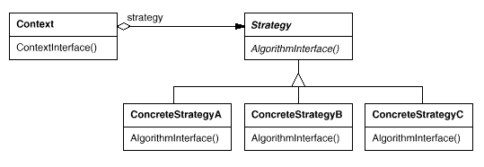

# Behavioral
---

Behavioral design patterns are design patterns that identify common communication patterns between objects and realize these patterns. By doing so, these patterns increase flexibility in carrying out this communication.

Behavioral class patterns use inheritance to distribute behavior between classes.

## Chain of Responsibilty

Gives more than one object an opportunity to handle a request by linking receiving objects together.

**Reference implementations in JDK**

`javax.servlet.Filter#doFilter()`

The doFilter method of the Filter is called by the container each time a request/response pair is passed through the chain due to a client request for a resource at the end of the chain. The FilterChain passed in to this method allows the Filter to pass on the request and response to the next entity in the chain.

`java.util.logging.Logger#log`

If the logger is currently enabled for the given message level then the given message is forwarded to all the registered output Handler objects.

---

## Command

**Intent**

- Encapsulate a request as an object, thereby letting you parametrize clients with different requests, queue or log requests, and support undoable operations.

**Problem**

Need to issue requests to objects without knowing anything about the operation being requested or the receiver of the request.

**Rules of thumb**

- Chain of Responsibility, Command, Mediator, and Observer, address how you can decouple senders and receivers, but with different trade-offs. Command normally specifies a sender-receiver connection with a subclass.

**Examples**

- All implementations of `java.lang.Runnable`
- All implementations of `javax.swing.Action`

to do ...

---

### Interpreter

**Examples**

- `java.util.Pattern`
- `java.text.Normalizer`
- All subclasses of `java.text.Format`
- All subclasses of `javax.el.ELResolver`

### Iterator

- All implementations of `java.util.Iterator` (thus among others also `java.util.Scanner`!).
- All implementations of `java.util.Enumeration`

### Mediator

- `java.util.Timer` (all `scheduleXXX()` methods)
- `java.util.concurrent.Executor#execute()`
- `java.util.concurrent.ExecutorService`(the `invokeXXX()` and `submit()` methods)
- `java.util.concurrent.ScheduledExecutorService` (all `scheduleXXX()` methods)
- `java.lang.reflect.Method#invoke()`

---

## Observer

**Intent**

Define a one-to-many dependency between objects so that when one object changes state, all its dependents are notified and updated automatically. Also Known As **Dependents**, **Publish-Subscribe**.

**Motivation**

The key objects in this pattern are **subject** and **observer**. A subject may have any number of dependent observers. All observers are notified whenever the subject undergoes a change in state. In response, each observer will query the subject to synchronize its state with the subject's state.

This kind of interaction is also known as publish-subscribe. The subject is the publisher of notifications. It sends out these notifications without having to know who its observers are. Any number of observers can subscribe to receive notifications.

**Applicability**

Use the Observer pattern in any of the following situations:

- When an abstraction has two aspects, one dependent on the
other.Encapsulating these aspects in separate objects lets you vary
and reuse them independently.

- When a change to one object requires changing others, and youdon't know
how many objects need to be changed.

- When an object should be able to notify other objects without
making assumptions about who these objects are. In other words, you don't want
these objects tightly coupled.

**Participants**

- Subject
	- knows its observers. Any number of Observer objects may observe a subject.
	- provides an interface for attaching and detaching Observer objects.

- Observer
	- defines an updating interface for objects that should be notified of changes in a subject.	
	
- ConcreteSubject
	- stores state of interest to ConcreteObserver objects.
	- sends a notification to its observers when its state changes.
	
- ConcreteObserver
	- maintains a reference to a ConcreteSubject object.
	- stores state that should stay consistent with the subject's.
	- implements the Observer updating interface to keep its state consistent with the subject's.
	
[Observer Code](./../Java/eclipse_projects/Design_Patterns/src/behavioral/observer)	
 
**Examples** 
 
- `java.util.Observer/java.util.Observable` (rarely used in real world though)
- All implementations of `java.util.EventListener` (practically all over Swing thus)
- `javax.servlet.http.HttpSessionBindingListener`
- `javax.servlet.http.HttpSessionAttributeListener`
- `javax.faces.event.PhaseListener`
 
---

## Strategy

**Intent**

- Define a family of algorithms, encapsulate each one, and make them interchangeable. Strategy lets the algorithm vary independently from the clients that use it. Also Known As Policy

- Capture the abstraction in an interface, bury implementation details in derived classes.

**Applicability**

- many related classes differ only in their behavior. Strategies provide a way to configure a class with one of many behaviors.
- you need different variants of an algorithm. For example, you might define algorithms reflecting different space/time trade-offs. Strategies can be used when these variants are implemented as a class hierarchy of algorithms.
- an algorithm uses data that clients shouldn't know about. Use the Strategy pattern to avoid exposing complex, algorithm-specific data structures.
- a class defines many behaviors, and these appear as multiple conditional statements in its operations. Instead of many conditionals, move related conditional branches into their own Strategy class.
- Strategy pattern is useful when we have multiple algorithms for specific task and we want our application to be flexible to chose any of the algorithm at runtime for specific task.

**Structure**

**Participants**

- *Strategy* - declares an interface common to all supported algorithms. Context uses this interface to call the algorithm defined by a ConcreteStrategy.

- *ConcreteStrategy* - implements the algorithm using the Strategy interface.

- *Context*
	- is configured with a ConcreteStrategy object.
	- maintains a reference to a Strategy object.
	- may define an interface that lets Strategy access its data.

	
**Examples**

- `Collections.sort()` and `Arrays.sort()` method that takes `Comparator` parameter. Based on the different implementations of `Comparator` interfaces, the Objects are getting sorted in different ways. `java.util.Comparator#compare()`, executed by among others `Collections#sort()`.
- javax.servlet.http.HttpServlet`, the `service()` and all `doXXX()` methods take `HttpServletRequest` and `HttpServletResponse` and the implementor has to process them (and not to get hold of them as instance variables!).
- `javax.servlet.Filter#doFilter()`	

	
**Check list**

1. Identify an algorithm (i.e. a behavior) that the client would prefer to access through a "flex point".
2. Specify the signature for that algorithm in an interface.
3. Bury the alternative implementation details in derived classes.
4. Clients of the algorithm couple themselves to the interface.

**Rules of thumb**

- Strategy is like Template Method except in its granularity.

- State is like Strategy except in its intent.

- Strategy lets you change the guts of an object. Decorator lets you change the skin.

- State, Strategy, Bridge (and to some degree Adapter) have similar solution structures. They all share elements of the 'handle/body' idiom. They differ in intent - that is, they solve different problems.

- Strategy has 2 different implementations, the first is similar to State. The difference is in binding times (Strategy is a bind-once pattern, whereas State is more dynamic).

- Strategy objects often make good Flyweights.
	
---

## Template method

**Intent**

Define the skeleton of an algorithm in an operation, deferring some steps to client subclasses. Template Method lets subclasses redefine certain steps of an algorithm without changing the algorithm's structure.

**Rules of thumb**

- Strategy is like Template Method except in its granularity.

- Template Method uses inheritance to vary part of an algorithm. Strategy uses delegation to vary the entire algorithm.

- Strategy modifies the logic of individual objects. Template Method modifies the logic of an entire class.

- Factory Method is a specialization of Template Method.

Examples: 

- All non-abstract methods of `java.io.InputStream`, `java.io.OutputStream`, `java.io.Reader` and `java.io.Writer`.
- All non-abstract methods of `java.util.AbstractList`, `java.util.AbstractSet` and `java.util.AbstractMap`.
- `javax.servlet.http.HttpServlet`, all the `doXXX()` methods by default sends a HTTP 405 "Method Not Allowed" error to the response. You're free to implement none or any of them.

- used extensively in Spring to deal with boilerplate repeated code (such as closing connections cleanly, etc..). For example `JdbcTemplate`, `JmsTemplate`, `JpaTemplate`.

---

## Memento

- `java.util.Date` (the setter methods do that, `Date` is internally represented by a long value)
- All implementations of `java.io.Serializable`
- All implementations of `javax.faces.component.StateHolder`

### Visitor

- `javax.lang.model.element.AnnotationValue` and `AnnotationValueVisitor`
- `javax.lang.model.element.Element` and ElementVisitor`
- `javax.lang.model.type.TypeMirror` and TypeVisitor`
- `java.nio.file.FileVisitor` and `SimpleFileVisitor`
- `javax.faces.component.visit.VisitContext` and `VisitCallback`

### Null Object

---
