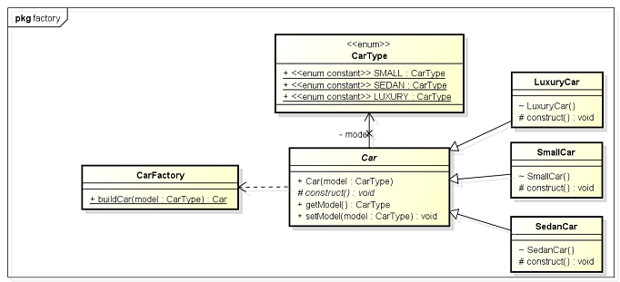
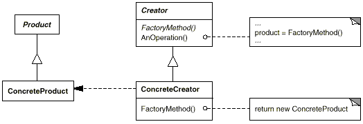
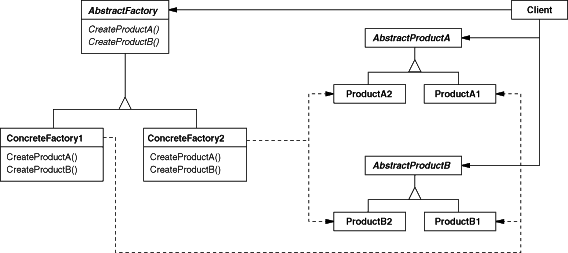

# Creational
---

Creational design patterns abstract the instantiation process. These deal with object creation mechanisms, trying to create objects in a manner suitable to the situation. The basic form of object creation could result in design problems or added complexity to the design. Creational design patterns solve this problem by somehow controlling this object creation.

A class creational pattern uses inheritance to vary the class that's instantiated, whereas an object creational pattern will delegate instantiation to another object.

---

## Singleton

Only single instance of object is created. On further requests same object is being returned.

[Singleton](./Singleton/Singleton.java)

To avoid creation of object through cloning override the `clone()` method and throw `CloneNotSupportedException`.

[Thread Safe Singleton](./Singleton/ThreadSingleton.java)

Double null check is required in Thread Safe Singleton design.

**Early instantiation using implementation with static field**

```java
//Early instantiation using implementation with static field.
class Singleton
{
	private static Singleton instance = new Singleton();

	private Singleton()
	{
		System.out.println("Singleton(): Initializing Instance");
	}

	public static Singleton getInstance()
	{    
		return instance;
	}

	public void doSomething()
	{
		System.out.println("doSomething(): Singleton does something!");
	}
}
```

### Examples

- `java.lang.Runtime#getRuntime()`

- `java.awt.Desktop#getDesktop()`

- `java.lang.System#getSecurityManager()`

- Logger Classes - This classes are usually implemented as a singletons, and provides a global logging access point in all the application components without being necessary to create an object each time a logging operations is performed.

- Factories implemented as Singletons 

- Beans defined in Spring config file are created only once unless the scope is specified as prototype.


### Hot Spot:

- **Multithreading** - A special care should be taken when singleton has to be used in a multithreading application.

- **Serialization** - When Singletons are implementing Serializable interface they have to implement `readResolve` method in order to avoid having 2 different objects.

- **Classloaders** - If the Singleton class is loaded by 2 different class loaders we'll have 2 different classes, one for each class loader.

- **Global Access Point represented by the class name** - The singleton instance is obtained using the class name. At the first view this is an easy way to access it, but it is not very flexible. If we need to replace the Sigleton class, all the references in the code should be changed accordinglly.

---

## Factory

Creates objects without exposing the instantiation logic to the client and Refers to the newly created object through a common interface. When a method returns one of several possible classes that share a common super class.

The factory pattern allows you to create objects without specifying the exact class of object that will be created.



**Examples**

- java.sql.DriverManager `getConnection()`
- java.net.URL `openConnection()`
- java.lang.Class `newInstance()`
- java.lang.Class `forName()`

---

## Factory Method

**Intent**

- Define an interface for creating an object, but let subclasses decide which class to instantiate. Factory Method lets a class defer instantiation to subclasses. Also Known As Virtual Constructor

**Structure**



- Product - defines the interface of objects the factory method creates.
- ConcreteProduct - implements the Product interface.
- Creator
	- declares the factory method, which returns an object of type Product. Creator may also define a default implementation of the factory method that returns a default ConcreteProduct object.
	- may call the factory method to create a Product object.
- ConcreteCreator - overrides the factory method to return an instance of a ConcreteProduct.	

**Rules of thumb**

- Abstract Factory classes are often implemented with Factory Methods, but they can be implemented using Prototype

- Factory Methods are usually called within Template Methods.

- Factory Method: creation through inheritance. Prototype: creation through delegation.

- Often, designs start out using Factory Method (less complicated, more customizable, subclasses proliferate) and evolve toward Abstract Factory, Prototype, or Builder (more flexible, more complex) as the designer discovers where more flexibility is needed.

- Prototype doesn't require subclassing, but it does require an Initialize operation. Factory Method requires subclassing, but doesn't require Initialize.


**Example**

- `java.util.Calendar#getInstance()`
- `java.util.ResourceBundle#getBundle()`
- `java.text.NumberFormat#getInstance()`
- `java.nio.charset.Charset#forName()`
- `java.net.URLStreamHandlerFactory#createURLStreamHandler(String)` (Returns singleton object per protocol)
- `java.util.EnumSet#of()`
- `javax.xml.bind.JAXBContext#createMarshaller()` and other similar methods

---

## Abstract Factory

**Intent**

- Provide an interface for creating families of related or dependent objects without specifying their concrete classes.
- A hierarchy that encapsulates: many possible "platforms", and the construction of a suite of "products".

The purpose of the Abstract Factory is to provide an interface for creating families of related objects, without specifying concrete classes.


**Applicability**

Use the Abstract Factory pattern when
- a system should be independent of how its products are created, composed, and represented.
- a system should be configured with one of multiple families of products.
- a family of related product objects is designed to be used together, and you need to enforce this constraint.
- you want to provide a class library of products, and you want to reveal just their interfaces, not their implementations.

**Structure**



- *AbstractFactory* 
	- declares an interface for operations that create abstract product objects.
- *ConcreteFactory*
	- implements the operations to create concrete product objects.
- *AbstractProduct*
	- declares an interface for a type of product object.
- *ConcreteProduct*
	- defines a product object to be created by the corresponding concrete factory.
	- implements the AbstractProduct interface.
- *Client*
	- uses only interfaces declared by AbstractFactory and AbstractProduct classes.
	
**Examples**

- `javax.xml.parsers.DocumentBuilderFactory#newInstance()`
- `javax.xml.transform.TransformerFactory#newInstance()`
- `javax.xml.xpath.XPathFactory#newInstance()`

**Rules of thumb**

- Sometimes creational patterns are competitors: there are cases when either Prototype or Abstract Factory could be used profitably. At other times they are complementary: Abstract Factory might store a set of Prototypes from which to clone and return product objects, Builder can use one of the other patterns to implement which components get built. Abstract Factory, Builder, and Prototype can use Singleton in their implementation.

- Abstract Factory, Builder, and Prototype define a factory object that's responsible for knowing and creating the class of product objects, and make it a parameter of the system. Abstract Factory has the factory object producing objects of several classes. Builder has the factory object building a complex product incrementally using a correspondingly complex protocol. Prototype has the factory object (aka prototype) building a product by copying a prototype object.

- Builder focuses on constructing a complex object step by step. Abstract Factory emphasizes a family of product objects (either simple or complex). Builder returns the product as a final step, but as far as the Abstract Factory is concerned, the product gets returned immediately.


---

### Builder

**Version 1**

Builder pattern is used to create objects of classes that have many attributes or properties and many of these are optional (they have default values). In such scenario constructor can take large number of arguements and to solve this problem a static nested class Builder is used which will build the object of the containing class.

Eg. Building a cake.

- Make a static nested class called Builder inside the class whose object will be build by Builder. In this example its Cake.

- Builder class will have exactly same set of fields as original class.

- Builder class will expose method for adding ingredients e.g. `sugar()` in this example. each method will return same Builder object. Builder will be enriched with each method call.

- Builder.build() method will copy all builder field values into actual class and return object of Item class.

- Item class (class for which we are creating Builder) should have private constructor to create its object from build() method and prevent outsider to access its constructor.

[Builder Pattern Example](./../Java/eclipse_projects/Design_Patterns/src/creational/builder/BasicBuilderPatternExample.java)

---

**Version 2**

**Intent**

Separate the construction of a complex object from its representation so that the same construction process can create different representations.


The participants classes in this pattern are:

- The **Builder** class specifies an abstract interface for creating parts of a Product object.
- The **ConcreteBuilder** constructs and puts together parts of the product by implementing the Builder interface. It defines and keeps track of the representation it creates and provides an interface for saving the product.
- The **Director** class constructs the complex object using the Builder interface.
- The **Product** represents the complex object that is being built.

The client, that may be either another object or the actual client that calls the main() method of the application, initiates the Builder and Director class. The Builder represents the complex object that needs to be built in terms of simpler objects and types. The constructor in the Director class receives a Builder object as a parameter from the Client and is responsible for calling the appropriate methods of the Builder class. In order to provide the Client with an interface for all concrete Builders, the Builder class should be an abstract one. This way you can add new types of complex objects by only defining the structure and reusing the logic for the actual construction process. The Client is the only one that needs to know about the new types, the Director needing to know which methods of the Builder to call.

[Builder Pattern](./../Java/eclipse_projects/Design_Patterns/src/creational/builder)

**Applicability**

Use the Builder pattern when

- the algorithm for creating a complex object should be independent of the parts that make up the object and how they're assembled.

- the construction process must allow different representations for the object that's constructed.

**Examples**

- `java.lang.StringBuilder#append()` (unsynchronized)
- `java.lang.StringBuffer#append()` (synchronized)
- `java.nio.ByteBuffer#put()` (also on `CharBuffer`, `ShortBuffer`, `IntBuffer`, `LongBuffer`, `FloatBuffer` and `DoubleBuffer`)
- `javax.swing.GroupLayout.Group#addComponent()`
- All implementations of `java.lang.Appendable`

---

## Prototype

**Intent**

- Specify the kinds of objects to create using a prototypical instance, and create new objects by copying this prototype.
- Co-opt one instance of a class for use as a breeder of all future instances.
- The `new` operator considered harmful.

**Applicability**

Use the Prototype pattern when a system should be independent of how its products
are created, composed, and represented; and

- when the classes to instantiate are specified at run-time, for example, by dynamic loading; or
- to avoid building a class hierarchy of factories that parallels the class hierarchy of products;
- when instances of a class can have one of only a few different combinations of state. It may be more convenient to install a corresponding number of prototypes and clone them rather than instantiating the class manually, each time with the appropriate state.

**Rules of thumb**

- Factory Method: creation through inheritance. Prototype: creation through delegation.
- Designs that make heavy use of the Composite and Decorator patterns often can benefit from Prototype as well.
 
**Examples**

- `java.lang.Object#clone()` (the class has to implement `java.lang.Cloneable`)

---
### Object Pool


---
