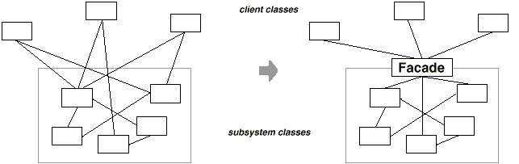
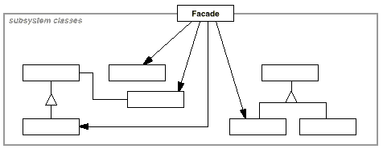
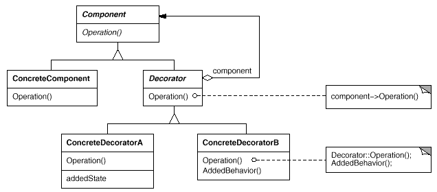
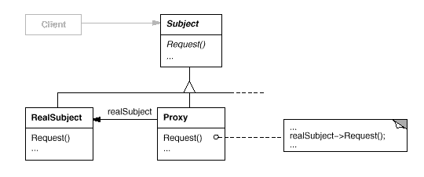
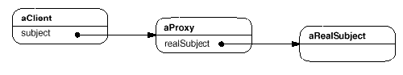

# Structural 
---

Structural patterns are concerned with how classes and objects are composed to form larger structures. They identify a simple way to realize relationships between entities.

## Adapter

**Intent**

- Convert the interface of a class into another interface clients expect.

- Adapter lets classes work together, that could not otherwise because of incompatible interfaces.

- Also known as **Wrapper**.

**Applicability**

Use the Adapter pattern when:

- you want to use an existing class, and its interface does not match the one you need.

- you want to create a reusable class that cooperates with unrelated or unforeseen classes, that is, classes that don't necessarily have compatible interfaces.

- (object adapter only) you need to use several existing subclasses, but it's impractical to adapt their interface by subclassing every one. An object adapter can adapt the interface of its parent class.

The classes/objects participating in adapter pattern:
- **Target** - defines the domain-specific interface that Client uses.
- **Adapter** - adapts the interface Adaptee to the Target interface.
- **Adaptee** - defines an existing interface that needs adapting.
- **Client** - collaborates with objects conforming to the Target interface.

The Adapter pattern lets you to adapt what an object or a class exposes to what another object or class expects. It converts the interface of a class into another interface the client expects. It lets classes work together that couldn’t otherwise because of incompatible interfaces. It allows to fix the interface between the objects and the classes without modifying the objects and the classes directly.

One can think of an Adapter as a real world adapter which is used to connect two different pieces of equipment that cannot be connected directly. An adapter sits in-between these equipments, it gets the flow from the equipment and provides it to the other equipment in the form it wants, which otherwise, is impossible to get due to their incompatible interfaces.

An adapter uses composition to store the object it is supposed to adapt, and when the adapter’s methods are called, it translates those calls into something the adapted object can understand and passes the calls on to the adapted object. The code that calls the adapter never needs to know that it’s not dealing with the kind of object it thinks it is, but an adapted object instead.

### Examples in Java

- `java.util.Arrays#asList()`
- `java.util.Collections#list()`
- `java.util.Collections#enumeration()`
- `java.io.InputStreamReader(InputStream)` (returns a Reader)
- `java.io.OutputStreamWriter(OutputStream)` (returns a Writer)
- `javax.xml.bind.annotation.adapters.XmlAdapter#marshal()` and `#unmarshal()`

### Rules of thumb

- Adapter makes things work after they're designed; Bridge makes them work before they are.

- Bridge is designed up-front to let the abstraction and the implementation vary independently. Adapter is retrofitted to make unrelated classes work together.

- Adapter provides a different interface to its subject. Proxy provides the same interface. Decorator provides an enhanced interface.

- Adapter is meant to change the interface of an existing object. Decorator enhances another object without changing its interface. Decorator is thus more transparent to the application than an adapter is. As a consequence, Decorator supports recursive composition, which isn't possible with pure Adapters.

- Facade defines a new interface, whereas Adapter reuses an old interface. Remember that Adapter makes two existing interfaces work together as opposed to defining an entirely new one.

[Adapter Pattern Code](./../Java/eclipse_projects/Design_Patterns/src/structural/adapter)

---

## Bridge

**Intent**

Decouple an abstraction from its implementation so that the two can vary independently. Also known as Handle/Body.

Publish interface in an inheritance hierarchy, and bury implementation in its own inheritance hierarchy.

The implementation of bridge design pattern follows the notion to prefer Composition over inheritance. This pattern decouples implementation class and abstract class by providing a bridge structure between them.

**Implementation idea**

Decompose the component's interface and implementation into orthogonal class hierarchies. The interface class contains a pointer to the abstract implementation class. This pointer is initialized with an instance of a concrete implementation class, but all subsequent interaction from the interface class to the implementation class is limited to the abstraction maintained in the implementation base class. The client interacts with the interface class, and it in turn "delegates" all requests to the implementation class.

The interface object is the "handle" known and used by the client; while the implementation object, or "body", is safely encapsulated to ensure that it may continue to evolve, or be entirely replaced (or shared at run-time).

**Applicability**

Use the Bridge pattern when:

- you want to avoid a permanent binding between an abstraction and its implementation. This might be the case, for example, when the implementation must be selected or switched at run-time.

- you have a proliferation of classes resulting from a coupled interface and numerous implementations, Such a class hierarchy indicates the need for splitting an object into two parts. Rumbaugh uses the term "nested generalizations" to refer to such class hierarchies.

- you need to map orthogonal class hierarchies.

**Structure**

The Client doesn't want to deal with platform-dependent details. The Bridge pattern encapsulates this complexity behind an abstraction "wrapper".

Bridge emphasizes identifying and decoupling "interface" abstraction from "implementation" abstraction

**Check list**

- Decide if two orthogonal dimensions exist in the domain. These independent concepts could be: abstraction/platform, or domain/infrastructure, or front-end/back-end, or interface/implementation.

- Design the separation of concerns: what does the client want, and what do the platforms provide.

- Design a platform-oriented interface that is minimal, necessary, and sufficient. Its goal is to decouple the abstraction from the platform.

- Define a derived class of that interface for each platform.

- Create the abstraction base class that "has a" platform object and delegates the platform-oriented functionality to it.

- Define specializations of the abstraction class if desired.

**Rules of thumb**

- Adapter makes things work after they're designed; Bridge makes them work before they are.

- Bridge is designed up-front to let the abstraction and the implementation vary independently. Adapter is retrofitted to make unrelated classes work together.

- State, Strategy, Bridge (and to some degree Adapter) have similar solution structures. They all share elements of the "handle/body" idiom. They differ in intent - that is, they solve different problems.

- The structure of State and Bridge are identical (except that Bridge admits hierarchies of envelope classes, whereas State allows only one). The two patterns use the same structure to solve different problems: State allows an object's behavior to change along with its state, while Bridge's intent is to decouple an abstraction from its implementation so that the two can vary independently.

- If interface classes delegate the creation of their implementation classes (instead of creating/coupling themselves directly), then the design usually uses the Abstract Factory pattern to create the implementation objects.

**Example**

-  A fictive example would be `new LinkedHashMap(LinkedHashSet<K>, List<V>)` which returns an unmodifiable linked map which doesn't clone the items, but uses them. The `java.util.Collections#newSetFromMap()` and `singletonXXX()` methods however comes close.

[Bridge Pattern Code](./../Java/eclipse_projects/Design_Patterns/src/structural/bridge)

---

## State

**Intent**

- Allow an object to alter its behavior when its internal state changes. The object will appear to change its class.

- Also Known As Objects for States. An object-oriented state machine . wrapper + polymorphic wrappee + collaboration

**Problem**

A monolithic object's behavior is a function of its state, and it must change its behavior at run-time depending on that state. Or, an application is characterized by large and numerous case statements that vector flow of control based on the state of the application.

**Discussion**

make behavior depend on state.

- Define a **Context** class to present a single interface to the outside world.

- Define a **State** abstract base class

- Represent the different "states" of the state machine as derived classes of the State base class.

- Define state-specific behavior in the appropriate State derived classes.

- Maintain a pointer to the current "state" in the "context" class.

- To change the state of the state machine, change the current "state" pointer.

**Rules of thumb**

- State objects are often Singletons.

- Flyweight explains when and how State objects can be shared.

- Interpreter can use State to define parsing contexts.

- Strategy has 2 different implementations, the first is similar to State. The difference is in binding times (Strategy is a bind-once pattern, whereas State is more dynamic).

- The structure of State and Bridge are identical (except that Bridge admits hierarchies of envelope classes, whereas State allows only one). The two patterns use the same structure to solve different problems: State allows an object's behavior to change along with its state, while Bridge's intent is to decouple an abstraction from its implementation so that the two can vary independently.

- The implementation of the State pattern builds on the Strategy pattern. The difference between State and Strategy is in the intent. With Strategy, the choice of algorithm is fairly stable. With State, a change in the state of the "context" object causes it to select from its "palette" of Strategy objects.
 
**Applicability**

- An object's behavior depends on its state, and it must change it's behavior at run-time depending on that state.

- Operations have large, multipart conditional statements that depend on the object's state. This state is usually represented by one or more enumerated constants. Often, several operations will contain this same conditional structure. The State pattern puts each branch of the conditional in a separate class. This lets you treat the object's state as an object in its own right that can vary independently from other objects.

**Known Uses**

- Johnson and Zweig characterize theState pattern and its application to TCP connection protocols.

[State Pattern Code](./../Java/eclipse_projects/Design_Patterns/src/behavioral/state)

---

## Facade

**Intent**

- Provide a unified interface to a set of interfaces in a subsystem. Facade defines a higher-level interface that makes the subsystem easier to use.

- Wrap a complicated subsystem with a simpler interface.

**Problem**

A segment of the client community needs a simplified interface to the overall functionality of a complex subsystem.

**Discussion**

Facade discusses encapsulating a complex subsystem within a single interface object. This reduces the learning curve necessary to successfully leverage the subsystem. It also promotes decoupling the subsystem from its potentially many clients. On the other hand, if the Facade is the only access point for the subsystem, it will limit the features and flexibility that "power users" may need.

The Facade object should be a fairly simple advocate or facilitator. It should not become an all-knowing oracle or "god" object.

**Motivation**

Structuring a system into subsystems helps reduce complexity. A common design goal is to minimize the communication and dependencies between subsystems. One way to achieve this goal is to introduce a **facade** object that provides a single, simplified interface to the more general facilities of a subsystem.

The Facade design pattern simplifies the interface to a complex system; because it is usually composed of all the classes which make up the subsystems of the complex system.

A Facade shields the user from the complex details of the system and provides them with a simplified view of it which is easy to use. It also decouples the code that uses the system from the details of the subsystems, making it easier to modify the system later.

the Facade can be used to hide the inner workings of a third party library, or some legacy code. All that the client needs to do is interact with the Facade, and not the subsystem that it is encompassing.

**Applicability**

Use the Facade pattern

- to provide a simple interface to a complex subsystem. Subsystems
often get more complex as they evolve. Most patterns, when applied, result
in more and smaller classes. This makes the subsystem more reusable and
easier to customize, but it also becomes harder to use for clients that
don't need to customize it. A facade can provide a simple default view of
the subsystem that is good enough for most clients. Only clients needing
more customizability will need to look beyond the facade.

- there are many dependencies between clients and the implementation classes
of an abstraction. Introduce a facade to decouple the subsystem from clients
and other subsystems, thereby promoting subsystem independence and
portability.

- you want to layer your subsystems. Use a facade to define an entry point
to each subsystem level. If subsystems are dependent, then you can simplify
the dependencies between them by making them communicate with each other
solely through their facades.

**Structure**

**Participants**

- Facade 
	- knows which subsystem classes are responsible for a request.
	- delegates client requests to appropriate subsystem objects.
	
- subsystem classes
	- implement subsystem functionality.
	- handle work assigned by the Facade object.
	- have no knowledge of the facade; that is, they keep no references to it.	

**Rules of thumb**

- Facade defines a new interface, whereas Adapter uses an old interface. Remember that Adapter makes two existing interfaces work together as opposed to defining an entirely new one.

- Whereas Flyweight shows how to make lots of little objects, Facade shows how to make a single object represent an entire subsystem.

- Mediator is similar to Facade in that it abstracts functionality of existing classes. Mediator abstracts/centralizes arbitrary communications between colleague objects. It routinely "adds value", and it is known/referenced by the colleague objects. In contrast, Facade defines a simpler interface to a subsystem, it doesn't add new functionality, and it is not known by the subsystem classes.

- Abstract Factory can be used as an alternative to Facade to hide platform-specific classes.

- Facade objects are often Singletons because only one Facade object is required.

- Adapter and Facade are both wrappers; but they are different kinds of wrappers. The intent of Facade is to produce a simpler interface, and the intent of Adapter is to design to an existing interface. While Facade routinely wraps multiple objects and Adapter wraps a single object; Facade could front-end a single complex object and Adapter could wrap several legacy objects.

**Uses**:

- Service oriented architectures make use of the facade pattern. For example, in web services, one web service might provide access to a number of smaller services that have been hidden from the caller by the facade.

- `javax.faces.context.FacesContext`, it internally uses among others the abstract/interface types `LifeCycle`, `ViewHandler`, `NavigationHandler` and many more without that the enduser has to worry about it (which are however overrideable by injection).

- `javax.faces.context.ExternalContext`, which internally uses `ServletContext`, `HttpSession`, `HttpServletRequest`, `HttpServletResponse`, etc.

---

### Composite

- `java.awt.Container#add(Component)` (practically all over Swing thus)
- `javax.faces.component.UIComponent#getChildren()` (practically all over JSF UI thus)

---

## Decorator

**Intent**

Attach additional responsibilities to an object dynamically. Decorators provide a flexible alternative to subclassing for extending functionality. Also known as Wrapper.

You want to add behavior or state to individual objects at run-time. Inheritance is not feasible because it is static and applies to an entire class.

**Applicability**

- to add responsibilities to individual objects dynamically and transparently, that is, without affecting other objects.
- for responsibilities that can be withdrawn.
- when extension by subclassing is impractical. Sometimes a large number of independent extensions are possible and would produce an explosion of subclasses to support every combination. Or a class definition may be hidden or otherwise unavailable for subclassing.

**Participants**

- *Component* : defines the interface for objects that can have responsibilities added to them dynamically.
- *ConcreteComponent* : defines an object to which additional responsibilities can be attached.
- *Decorator* : maintains a reference to a Component object and defines an interface that conforms to Component's interface.
- *ConcreteDecorator* : adds responsibilities to the component.

**Benefits**

- More flexibility than static inheritance.
- Avoids feature-laden classes high up in the hierarchy. Decorator offers a pay-as-you-go approach to adding responsibilities.

**Known Uses**

- Decorator pattern is used a lot in Java IO classes, such as `FileReader`, `BufferedReader`. BufferReader is wrapped to FileReader, ObjectOutputStream is wrapped to FileInputStream in serialization. All subclasses of java.io.InputStream, OutputStream, Reader and Writer have a constructor taking an instance of same type.
- java.util.Collections, the checkedXXX(), synchronizedXXX() and unmodifiableXXX() methods.
- javax.servlet.http.HttpServletRequestWrapper and HttpServletResponseWrapper

**Check list**

- Ensure the context is: a single core (or non-optional) component, several optional embellishments or wrappers, and an interface that is common to all.

- Create a "Lowest Common Denominator" interface that makes all classes interchangeable.

- Create a second level base class (Decorator) to support the optional wrapper classes.

- The Core class and Decorator class inherit from the LCD interface.

- The Decorator class declares a composition relationship to the LCD interface, and this data member is initialized in its constructor.

- The Decorator class delegates to the LCD object

- Define a Decorator derived class for each optional embellishment.

- Decorator derived classes implement their wrapper functionality - and - delegate to the Decorator base class.

- The client configures the type and ordering of Core and Decorator objects.

**Related Patterns**

*Adapter* : A decorator is different from an adapter in that a decorator only changes an object's responsibilities, not its interface; an adapter will give an object a completely new interface.

*Composite* : A decorator can be viewed as a degenerate composite with only one component. However, a decorator adds additional responsibilities—it isn't intended for object aggregation.

*Strategy* : A decorator lets you change the skin of an object; a strategy lets you change the guts. These are two alternative ways of changing an object.

[Decorator Pattern Code](./../Java/eclipse_projects/Design_Patterns/src/structural/decorator)

---

## Proxy

**Intent**

- Provide a surrogate or placeholder for another object to control access to it.
	
- Use an extra level of indirection to support distributed, controlled, or intelligent access.

- Add a wrapper and delegation to protect the real component from undue complexity.

**Problem**

You need to support resource-hungry objects, and you do not want to instantiate such objects unless and until they are actually requested by the client.

**Discussion**

Design a surrogate, or proxy, object that: instantiates the real object the first time the client makes a request of the proxy, remembers the identity of this real object, and forwards the instigating request to this real object. Then all subsequent requests are simply forwarded directly to the encapsulated real object.

**Applicability**	
	
Proxy is applicable whenever there is a need for a more versatile or sophisticated reference to an object than a simple pointer.	
	
- A *remote proxy* provides a local representative for an object in a different address space.	

- A *virtual proxy* creates expensive objects on demand. A virtual proxy is a placeholder for "expensive to create" objects. The real object is only created when a client first requests/accesses the object.

- A *protection proxy* controls access to the original object. Protection proxies are useful when objects should have different access rights. The "surrogate" object checks that the caller has the access permissions required prior to forwarding the request.

- A *smart reference* is a replacement for a bare pointer that performs additional actions when an object is accessed. Typical uses include:
	- counting the number of references to the real object so that it can be freed automatically when there are no more references (also called smart pointers).
	- loading a persistent object into memory when it's first referenced.
	- checking that the real object is locked before it's accessed to ensure that no other object can change it.

**Consequences**

The Proxy pattern introduces a level of indirection when accessing an object. The additional indirection has many uses, depending on the kind of proxy:

1. A remote proxy can hide the fact that an object resides in a different address space.
2. A virtual proxy can perform optimizations such as creating an object on demand.
3. Both protection proxies and smart references allow additional housekeeping tasks when an object is accessed.

	
**Structure**

Possible object diagram of a proxy structure at run-time

**Example**

The Proxy provides a surrogate or place holder to provide access to an object. A check or bank draft is a proxy for funds in an account. A check can be used in place of cash for making purchases and ultimately controls access to cash in the issuer's account.

*Java Remote Method Invocation (RMI)*

In java RMI an object on one machine (executing in one JVM) called a client can invoke methods on an object in another machine (another JVM) the second object is called a remote object. The proxy (also called a stub) resides on the client machine and the client invokes the proxy in as if it is invoking the object itself (remember that the proxy implements the same interface that RealSubject implements). The proxy itself will handle communication to the remote object, invoke the method on that remote object, and would return the result if any to the client. The proxy in this case is a Remote proxy.

- Spring proxy in AOP
- `java.lang.reflect.Proxy`
- `java.rmi.*`
- `javax.ejb.EJB`
- `javax.inject.Inject`
- `javax.persistence.PersistenceContext`

**Check list**

- Identify the leverage or "aspect" that is best implemented as a wrapper or surrogate.
- Define an interface that will make the proxy and the original component interchangeable.
- Consider defining a Factory that can encapsulate the decision of whether a proxy or original object is desirable.
- The wrapper class holds a pointer to the real class and implements the interface.
- The pointer may be initialized at construction, or on first use.
- Each wrapper method contributes its leverage, and delegates to the wrappee object.

**Related Patterns**

*Adapter*: An adapter provides a different interface to the object it adapts. In contrast, a proxy provides the same interface as its subject. However, a proxy used for access protection might refuse to perform an operation that the subject will perform, so its interface may be effectively a subset of the subject's.

*Decorator*: Although decorators can have similar implementations as proxies, decorators have a different purpose. A decorator adds one or more responsibilities to an object, whereas a proxy controls access to an object.

*Iterator* describes another kind of proxy

---

### Flyweight

**Intent**

- Use sharing to support large numbers of fine-grained objects efficiently.

**Uses:**

(recognizeable by creational methods returning a cached instance, a bit the "multiton" idea)

- `java.lang.Integer#valueOf(int)` (also on `Boolean`, `Byte`, `Character`, `Short`, `Long` and `BigDecimal`)

### Memento

---