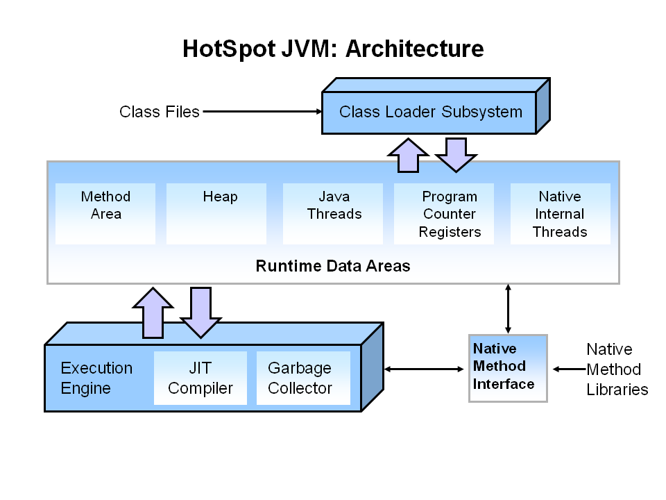

# Inside JVM

JVM is the **virtual machine** on which **java code executes**.

JVM is responsible for **converting byte code into machine specific code**.

JVM (Java Virtual Machine) consists of **Class Loader Subsystem**, **Runtime Data Areas** and **Execution Engine**.

## Class Loader Subsystem

Classloader is a subsystem of JVM. Classloader is used to load class files. Classloader verifies the class file using byte code verifier. Class file will only be loaded if it is valid.

---

## Runtime Data Areas

### Method Area

Method area is also called class area. Method area stores data for each and every class like fields, constant pool, method’s data and information.

### Heap

Heap is place where all objects are stored in JVM. 

### Java Threads (Java thread Stacks) 

Every thread has its own stack. Whenever new method is called new stack frame is created and it is pushed on top of that thread's stack. Thread stack contains all the local variables, parameters and return address.
Stack never stores object, but it stores object reference.

### Program counter registers (PC Registers) 

Program counter registers contains the address of instructions currently being executed and address of next instruction as well.

### Native internal Threads (Native thread stack)

Native internal threads area contains all the informations related to native platform e.g. windows or linux.

---

## Execution Engine of JVM

---
 
Java addresses the security challenge by providing an environment in which programs downloaded across a network can be run with customizable degrees of security. A downloaded program can do anything it wants inside the boundaries of the secure environment, but can't read or write data outside those boundaries.

Platform independence, security, and network-mobility--these three facets of Java's architecture work
together to make Java suitable for the emerging networked computing environment. Because Java
programs are platform independent, network-delivery of software is more practical.

A Java Virtual Machine's main job is to load class files and execute the bytecodes they contain.
