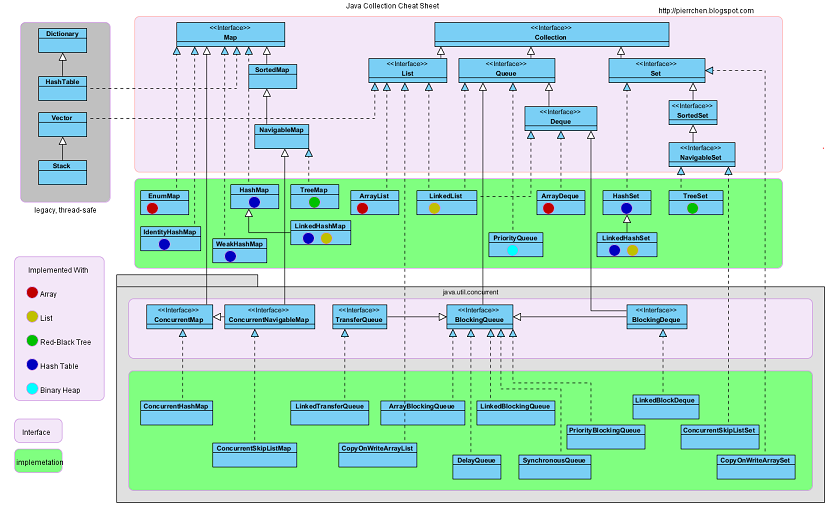

# Generics
 
---

## Benefits

- Stronger type checks at compile time. 

- Elimination of casts.

- Enabling programmers to implement generic algorithms.

---

## Raw Types

A raw type is the name of a generic class or interface without any type arguments. For example, given the generic Box class:

```java
public class Box<T> {
    public void set(T t) { /* ... */ }
    // ...
}
```

parameterized type: ```Box<Integer> intBox = new Box<>();```

raw type: ```Box rawBox = new Box();```

For backward compatibility, assigning a parameterized type to its raw type is allowed. But if you assign a raw type to a parameterized type, you get a warning.

You also get a warning if you use a raw type to invoke generic methods defined in the corresponding generic type:
```java
Box<String> stringBox = new Box<>();
Box rawBox = stringBox;
rawBox.set(8);  // warning: unchecked invocation to set(T)
```
The warning shows that raw types bypass generic type checks, deferring the catch of unsafe code to runtime. Therefore, you should avoid using raw types.
 
---

## Bounded Type Parameters

Restrict the types that can be used as type arguments in a parameterized type. For example, a method that operates on numbers might only want to accept instances of Number or its subclasses.
 
To declare a bounded type parameter, list the type parameter's name, followed by the `extends` keyword, followed by its upper bound, which in this example is `Number`. **Note that, in this context, `extends` is used in a general sense to mean either `extends` (as in classes) or `implements` (as in interfaces).**

In addition to limiting the types you can use to instantiate a generic type, bounded type parameters allow you to invoke methods defined in the bounds:
```java
public class NaturalNumber<T extends Integer> {

    private T n;

    public NaturalNumber(T n)  { this.n = n; }

    public boolean isEven() {
        return n.intValue() % 2 == 0;
    }

    // ...
}
```

---
## Generic Methods

Generic methods are methods that introduce their own type parameters. This is similar to declaring a generic type, but the type parameter's scope is limited to the method where it is declared. Static and non-static generic methods are allowed, as well as generic class constructors.

The syntax for a generic method includes a type parameter, inside angle brackets, and appears before the method's return type. For static generic methods, the type parameter section must appear before the method's return type.

```java
public static <U> void outputBoxes(java.util.List<Box<U>> boxes) {
    int counter = 0;
    for (Box<U> box: boxes) {
      U boxContents = box.get();
      System.out.println("Box #" + counter + " contains [" +
             boxContents.toString() + "]");
      counter++;
    }
  }
```

### Generic Methods and Bounded Type Parameters

Consider the following method:
```java
public static <T> int countGreaterThan(T[] anArray, T elem) {
    int count = 0;
    for (T e : anArray)
        if (e > elem)  // compiler error
            ++count;
    return count;
}
```
it does not compile because the greater than operator (>) applies only to primitive types such as short, int, double, long, float, byte, and char. You cannot use the > operator to compare objects. To fix the problem, use a type parameter bounded by the Comparable<T> interface:
```java
public interface Comparable<T> {
    public int compareTo(T o);
}
```
The resulting code will be:
```java
public static <T extends Comparable<T>> int countGreaterThan(T[] anArray, T elem) {
    int count = 0;
    for (T e : anArray)
        if (e.compareTo(elem) > 0)
            ++count;
    return count;
}
```

---

## Type Inference and Instantiation of Generic Classes

*Type inference* is a Java compiler's ability to look at each method invocation and corresponding declaration to determine the type argument (or arguments) that make the invocation applicable.

You can replace the type arguments required to invoke the constructor of a generic class with an empty set of type parameters (<>) as long as the compiler can infer the type arguments from the context.

For example, consider the following variable declaration:

```java
Map<String, List<String>> myMap = new HashMap<String, List<String>>();
```

You can substitute the parameterized type of the constructor with an empty set of type parameters (<>):
```java
Map<String, List<String>> myMap = new HashMap<>();
```

---

## Wildcards

In generic code, the question mark (?), called the wildcard, represents an unknown type. The wildcard can be used in a variety of situations: as the type of a parameter, field, or local variable; sometimes as a return type (though it is better programming practice to be more specific). The wildcard is never used as a type argument for a generic method invocation, a generic class instance creation, or a supertype.

### Upper Bounded Wildcards

To declare an upper-bounded wildcard, use the wildcard character ('?'), followed by the extends keyword, followed by its upper bound. Note that, in this context, extends is used in a general sense to mean either "extends" (as in classes) or "implements" (as in interfaces).

```java
public static void process(List<? extends Foo> list) {
    for (Foo elem : list) {
        // ...
    }
}
```

### Unbounded Wildcards

The unbounded wildcard type is specified using the wildcard character (?), for example, List<?>. This is called a list of unknown type. There are two scenarios where an unbounded wildcard is a useful approach:

If you are writing a method that can be implemented using functionality provided in the Object class.
When the code is using methods in the generic class that don't depend on the type parameter. For example, List.size or List.clear. In fact, Class<?> is so often used because most of the methods in Class<T> do not depend on T.

```java
public static void printList(List<?> list) {
    for (Object elem: list)
        System.out.print(elem + " ");
    System.out.println();
}
```

### Lower Bounded Wildcards

A lower bounded wildcard is expressed using the wildcard character ('?'), following by the super keyword, followed by its lower bound: `<? super A>`.

**Note: You can specify an upper bound for a wildcard, or you can specify a lower bound, but you cannot specify both.**

```java
	public static void addNumbers(List<? super Integer> list) {
		for (int i = 1; i <= 10; i++) {
			list.add(i);
		}

		System.out.println(list);
	}

```


### Guidelines for Wildcard Use

**An "In" Variable**
	An "in" variable serves up data to the code. Imagine a copy method with two arguments: copy(src, dest). The src argument provides the data to be copied, so it is the "in" parameter.

**An "Out" Variable**
	An "out" variable holds data for use elsewhere. In the copy example, copy(src, dest), the dest argument accepts data, so it is the "out" parameter.

Of course, some variables are used both for "in" and "out" purposes — this scenario is also addressed in the guidelines.

You can use the "in" and "out" principle when deciding whether to use a wildcard and what type of wildcard is appropriate. The following list provides the guidelines to follow:

---

**Wildcard Guidelines: **

- An "in" variable is defined with an upper bounded wildcard, using the extends keyword.
- An "out" variable is defined with a lower bounded wildcard, using the super keyword.
- In the case where the "in" variable can be accessed using methods defined in the Object class, use an unbounded wildcard.
- In the case where the code needs to access the variable as both an "in" and an "out" variable, do not use a wildcard.

	---

These guidelines do not apply to a method's return type. Using a wildcard as a return type should be avoided because it forces programmers using the code to deal with wildcards.
 
---

## ??

- Java compiler error: generic array creation

---

---

# Collections



## Collection << Interface >>

```java
public interface Collection<E>
extends Iterable<E>
```

The root interface in the collection hierarchy. A collection represents a group of objects, known as its elements.

## List << Interface >>

```java
public interface List<E>
extends Collection<E>
```

An ordered collection (also known as a sequence). The user of this interface has precise control over where in the list each element is inserted. The user can access elements by their integer index (position in the list), and search for elements in the list.

lists typically allow duplicate elements. 

The `List` interface provides a special iterator, called a `ListIterator`, that allows element insertion and replacement, and bidirectional access in addition to the normal operations that the Iterator interface provides.

Implementations:

---

### ArrayList (Class)

```java
public class ArrayList<E>
extends AbstractList<E>
implements List<E>, RandomAccess, Cloneable, Serializable
```

Resizable-array implementation of the `List` interface. 

Implements all optional list operations, and permits all elements, including null. In addition to implementing the List interface, this class provides methods to manipulate the size of the array that is used internally to store the list. (This class is roughly equivalent to Vector, except that **it is unsynchronized**.)

The `size`, `isEmpty`, `get`, `set`, `iterator`, and `listIterator` operations run in constant time. The add operation runs in *amortized constant time*, that is, adding n elements requires O(n) time. All of the other operations run in linear time (roughly speaking). The constant factor is low compared to that for the `LinkedList` implementation.

Each ArrayList instance has a capacity. As elements are added to an ArrayList, its capacity grows automatically.

An application can increase the capacity of an ArrayList instance before adding a large number of elements using the `ensureCapacity` operation. This may reduce the amount of incremental reallocation.

```java
public void ensureCapacity(int minCapacity)
```

**this implementation is not synchronized.** To externally synchronize the list should be "wrapped" using the `Collections.synchronizedList` method. This is best done at creation time, to prevent accidental unsynchronized access to the list:

```java
   List list = Collections.synchronizedList(new ArrayList(...));
```

The iterators returned by this class's iterator and listIterator methods are **fail-fast**: if the list is structurally modified at any time after the iterator is created, in any way except through the iterator's own remove or add methods, the iterator will throw a `ConcurrentModificationException`. Thus, in the face of concurrent modification, the iterator fails quickly and cleanly, rather than risking arbitrary, non-deterministic behavior at an undetermined time in the future.

---
   
### Vector (Class)   

```java
public class Vector<E>
extends AbstractList<E>
implements List<E>, RandomAccess, Cloneable, Serializable
```

The `Vector` class implements a growable array of objects. Like an array, it contains components that can be accessed using an integer index. However, the size of a `Vector` can grow or shrink as needed to accommodate adding and removing items after the `Vector` has been created.

As of the Java 2 platform v1.2, this class was retrofitted to implement the `List` interface, making it a member of the Java Collections Framework. Unlike the new collection implementations, `Vector` is synchronized. If a thread-safe implementation is not needed, it is recommended to use `ArrayList` in place of `Vector`.

---

### CopyOnWriteArrayList (Class) 

```java
package java.util.concurrent

public class CopyOnWriteArrayList<E>
extends Object
implements List<E>, RandomAccess, Cloneable, Serializable
```

A thread-safe variant of `ArrayList` in which all mutative operations (add, set, and so on) are implemented by making a fresh copy of the underlying array. 

This is ordinarily too costly, but may be more efficient than alternatives when traversal operations vastly outnumber mutations, and is useful when you cannot or don't want to synchronize traversals, yet need to preclude interference among concurrent threads.

The "snapshot" style iterator method uses a reference to the state of the array at the point that the iterator was created. This array never changes during the lifetime of the iterator, so interference is impossible and the iterator is guaranteed not to throw `ConcurrentModificationException`. The iterator will not reflect additions, removals, or changes to the list since the iterator was created. Element-changing operations on iterators themselves (remove, set, and add) are not supported. These methods throw `UnsupportedOperationException`.

Memory consistency effects: As with other concurrent collections, actions in a thread prior to placing an object into a `CopyOnWriteArrayList` **happen-before** actions subsequent to the access or removal of that element from the `CopyOnWriteArrayList` in another thread.

---

###	LinkedList (Class)

```java
public class LinkedList<E>
extends AbstractSequentialList<E>
implements List<E>, Deque<E>, Cloneable, Serializable
```

Doubly-linked list implementation of the `List` and `Deque` interfaces. Implements all optional list operations, and permits all elements (including `null`).

**this implementation is not synchronized**. To synchronize the list should be "wrapped" using the `Collections.synchronizedList` method. This is best done at creation time, to prevent accidental unsynchronized access to the list:

```java
   List list = Collections.synchronizedList(new LinkedList(...));
```

---

## Set << Interface >>

```java
public interface Set<E>
extends Collection<E>
```

A collection that contains no duplicate elements. More formally, sets contain no pair of elements `e1` and `e2` such that `e1.equals(e2)`, and at most one `null` element. As implied by its name, this interface models the mathematical *set* abstraction.

### HashSet (Class)

```java
public class HashSet<E>
extends AbstractSet<E>
implements Set<E>, Cloneable, Serializable
```

This class implements the Set interface, backed by a hash table (actually a `HashMap` instance). It makes no guarantees as to the iteration order of the set; in particular, it does not guarantee that the order will remain constant over time. This class permits the null element.

Offers constant time performance for the basic operations (add, remove, contains and size), assuming the hash function disperses the elements properly among the buckets. Iterating over this set requires time proportional to the sum of the HashSet instance's size (the number of elements) plus the "capacity" of the backing HashMap instance (the number of buckets). Thus, it's very important not to set the initial capacity too high (or the load factor too low) if iteration performance is important.


---

## Map

an object that maps keys to values, an associative array, a table: the map.

