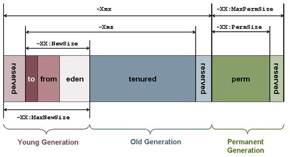

# Garbage Collection

---

## Garbage

**Garbage** means memory the system has previously allocated is no longer being used. For the illusion of infinite memory to work, the language needs to be very safe about “no longer being used”. In order to be collectible, the language has to ensure there’s no way for the program to use that object again. If it can’t get a reference to the object, then it obviously can’t use it again.

The definition of **in use**:

- Any object that’s being referenced by a variable that’s still in scope is in use.

- Any object that’s referenced by another object that’s in use is in use. 

The second rule is the recursive one. If object A is referenced by a variable, and it has some field that references object B, then B is in use since you can get to it through A.

The end result is a graph of reachable objects-all of the objects in the world that you can get to by starting at a variable and traversing through objects. Any object not in that graph of reachable objects is dead to the program and its memory is ripe for a reaping.

---

## Garbage Collector

A garbage collector (GC) is a memory management tool. It achieves automatic memory management through the following operations:

- Allocating objects to a young generation and promoting aged objects into an old generation.

- Finding live objects in the old generation through a concurrent (parallel) marking phase. The Java HotSpot VM triggers the marking phase when the total Java heap occupancy exceeds the default threshold.

- Recovering free memory by compacting live objects through parallel copying. 

---

## Some Pointers

- Objects are created on the heap in Java irrespective of their scope e.g. local or member variable. while it's worth noting that **class variables or static members are created in method area of Java memory space and both heap and method area is shared between different thread**.

- Garbage Collection in Java is carried by a daemon thread called Garbage Collector.

- Before removing an object from memory garbage collection thread invokes `finalize()` method of that object and gives an opportunity to perform any sort of cleanup required. 

- There are methods like `System.gc()` and `Runtime.gc()` which is used to send request of Garbage collection to JVM but it’s not guaranteed that garbage collection will happen.

- If there is no memory space for creating a new object in Heap Java Virtual Machine throws OutOfMemoryError or `java.lang.OutOfMemoryError` heap space.


## When an Object becomes Eligible for Garbage Collection

- All references to that object explicitly set to null e.g. `object = null;`

- The object is created inside a block and reference goes out scope once control exit that block.

- Parent object set to null; if an object holds the reference to another object and when you set container object's reference null, child or contained object automatically becomes eligible for garbage collection.

- If an object has only lived weak references via `WeakHashMap` it will be eligible for garbage collection.

---

## Heap Generations for Garbage Collection in Java

Heap is divided into three parts or generations for the sake of garbage collection in Java.

These are called as **Young generation**, **Tenured** or **Old Generation** and **Perm Area** of the heap.  New Generation is further divided into three parts known as **Eden space**, **Survivor 1** and **Survivor 2** space. When an object first created in heap its gets created in new generation inside **Eden space** and after subsequent **minor garbage collection** if an object survives its gets moved to **survivor 1** and then **survivor 2** before **major garbage collection** moved that object to old or **tenured generation**.



---
  
  
## Marking and sweeping


Garbage collection algorithm must perform 2 basic operations. One, it should be able to detect all the unreachable objects and secondly, it must reclaim the heap space used by the garbage objects and make the space available again to the program. Mark and Sweep Algorithm operates in two phases:

**Mark Phase**

When an object is created, its mark bit is set to 0(false). In the Mark phase, we set the marked bit for all the reachable objects (or the objects which a user can refer to) to 1(true). This operation can be done by a graph traversal, a depth first search approach.  Consider every object as a node and then all the nodes (objects) that are reachable from this node (object) are visited and it goes on till we have visited all the reachable nodes.

*Algorithm -Mark phase:*

```
Mark(root)
    If markedBit(root) = false then
        markedBit(root) = true
        For each v referenced by root
             Mark(v)
```

**Sweep Phase**
			 
it clears the heap memory for all the unreachable objects. All those objects whose marked value is set to false are cleared from the heap memory, for all other objects (reachable objects) the marked bit is set to false.

Now the mark value for all the reachable objects is set to false, since we will run the algorithm (if required) and again we will go through the mark phase to mark all the reachable objects.

*Algorithm – Sweep Phase:*

```
Sweep()
For each object p in heap
    If markedBit(p) = true then
        markedBit(p) = false
    else
        heap.release(p)			 
```

The mark-and-sweep algorithm is called a tracing garbage collector because is traces out the entire collection of objects that are directly or indirectly accessible by the program.

**Advantages of Mark and Sweep Algorithm**

- It handles the case with cyclic references, even in case of a cycle, this algorithm never ends up in an infinite loop.

- There are no additional overheads incurred during the execution of the algorithm.

**Disadvantages of Mark and Sweep Algorithm**

- The main disadvantage of the mark-and-sweep approach is the fact that that normal program execution is suspended while the garbage collection algorithm runs.

- Other disadvantage is that, after the Mark and Sweep Algorithm is run several times on a program, reachable objects end up being separated by many, small unused memory regions.
 
---


## Reference classes

### Strong Reference 

String s = "abc" , reference variable s has strong reference to String object "abc". Any object which has Strong reference attached to it is not eligible for garbage collection. Obviously these are objects which is needed by Java program.

###  Weak Reference 

Represented using `java.lang.ref.WeakReference` class and you can create Weak Reference by using following code :

```java
Counter counter = new Counter(); // strong reference - line 1
WeakReference<Counter> weakCounter = new WeakReference<Counter>(counter); //weak reference
counter = null; // now Counter object is eligible for garbage collection
```

SoftReference are more suitable for caches and WeakReference are more suitable for storing meta data. 
 
---
