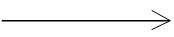
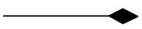
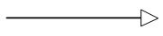
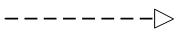
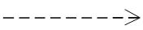

# OOPS and OOAD

# S.O.L.I.D. principles in java

 

- Open closed design principles says that new functionality should be added by introducing new classes, methods or fields instead of modifying already tried and tested code. One of the way to achieve this is Inheritance where class is extended to introduce new functionality on top of inherited basic features.
 
---

## Object-Oriented Analysis

Object-oriented analysis is a method of analysis that examines requirements from the perspective of the classes and objects found in the vocabulary of the problem domain.

The primary tasks in object-oriented analysis (OOA) are:

- Identifying objects

- Organizing the objects by creating object model diagram

- Defining the internals of the objects, or object attributes

- Defining the behavior of the objects, i.e., object actions

- Describing how the objects interact

---

## Relationship between Objects

**Association**

Association is a relationship between two objects. In other words, association defines the multiplicity between objects. Aggregation is a special form of association. Composition is a special form of aggregation.

**Aggregation**

Aggregation is a special case of association. A directional association between objects. When an object ‘has-a’ another object, then you have got an aggregation between them. Direction between them specified which object contains the other object. Aggregation is also called a **Has-a** relationship.

**Composition**

Composition is a special case of aggregation. In a more specific manner, a restricted aggregation is called composition. When an object contains the other object, if the contained object cannot exist without the existence of container object, then it is called composition.

**Generalization**

Generalization uses a “is-a” relationship from a specialization to the generalization class. Common structure and behaviour are used from the specializtion to the generalized class. At a very broader level you can understand this as inheritance. Why I take the term inheritance is, you can relate this term very well. Generalization is also called a “Is-a” relationship.

**Realization**

Realization is a relationship between the blueprint class and the object containing its respective implementation level details. This object is said to realize the blueprint class. In other words, you can understand this as the relationship between the interface and the implementing class

**Dependency**

Change in structure or behaviour of a class affects the other related class, then there is a dependency between those two classes. It need not be the same vice-versa. When one class contains the other class it this happens.

---

## Overloading and Overriding

- Methods can be overridden or overloaded; constructors can be overloaded but not overridden.

- With respect to the method it overrides, the overriding method
	-	Must have the same argument list.
	-	Must have the same return type, except that as of Java 5, the return type can be a subclass—this is known as a covariant return.
	-	Must not have a more restrictive access modifier.
	-	May have a less restrictive access modifier.
	-	Must not throw new or broader checked exceptions.
	-	May throw fewer or narrower checked exceptions, or any unchecked exception.

- A subclass uses `super.overriddenMethodName()` to call the superclass version of an overridden method.

- Overloading means reusing a method name, but with different arguments.

- Overloaded methods
	- Must have different argument lists
	- May have different return types, if argument lists are also different
	- May have different access modifiers
	- May throw different exceptions
	- Methods from a superclass can be overloaded

- Polymorphism applies to overriding, not to overloading. Also only methods are overriden instance variables are **NOT** overriden.

- **Object type (not the reference variable's type), determines which overridden method is used at runtime**.

- **Reference type determines which overloaded method will be used at compile time**.	

---

## Constructors and Instantiation

- A constructor is always invoked when a new object is created.

- Each superclass in an object's inheritance tree will have a constructor called.

- Every class, even an abstract class, has at least one constructor.

- Typical constructor execution occurs as follows:

	- The constructor calls its superclass constructor, which calls its superclass
constructor, and so on all the way up to the Object constructor.
	
	- The Object constructor executes and then returns to the calling
constructor, which runs to completion and then returns to its calling
constructor, and so on back down to the completion of the constructor of
the actual instance being created.

- The default constructor is a no-arg constructor with a no-arg call to super().

- The first statement of every constructor must be a call to either `this()` (an
overloaded constructor) or `super()`.

- The compiler will add a call to `super()` unless you have already put in a call
to `this()` or `super()`.

- If your superclass does not have a no-arg constructor, you must create a constructor
and insert a call to `super()` with arguments matching those
of the superclass constructor.

- A constructor can be directly invoked only by another constructor (using
a call to `super()` or `this()`).

- Issues with calls to `this()`:
	- May appear only as the first statement in a constructor.
	- The argument list determines which overloaded constructor is called.

- Calls to `this()` and `super()` cannot be in the same constructor. You can
have one or the other, but never both.

---

## Abstraction

The process of abstraction in Java is used to hide certain details and only show the essential features of the object. In other words, it deals with the outside view of an object (interface).

Abstraction in Java is achieved by  using interface and abstract class in Java.

--- 

## Encapsulation

Its basically about hiding the state of object with the help of modifiers like private,public,protected etc. we expose the state through public methods only if require.

---

## Abstraction and Encapsulation difference

- Abstraction is implemented in Java using interface and abstract class while Encapsulation is implemented using private, package-private and protected access modifier.
 
- Encapsulation is also called data hiding. 

**Abstraction** : you'll never buy a "device", but always buy something more specific : iPhone, GSII, Nokia 3310... Here, iPhone, GSII and N3310 are concrete things, device is abstract.
 
**Encapsulation** : you've got several devices, all of them have got an USB port. You don't know what kind of printed circuit there's back, you just have to know you'll be able to plug an USB cable onto.

---

## Inheritance

---

## Polymorphism

---

## Inheritance Vs Composition

---

## Questions:-

- Why Java doesn't support multiple inheritance?
	
	First reason is ambiguity around Diamond problem. Second reason is multiple inheritances does complicate the design and creates problem during casting, constructor chaining etc and given that there are not many scenario on which you need multiple inheritance its wise decision to omit it for the sake of simplicity.
