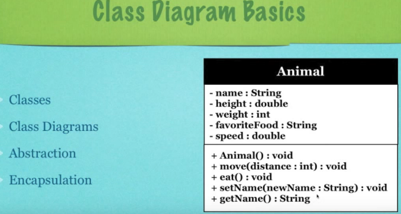
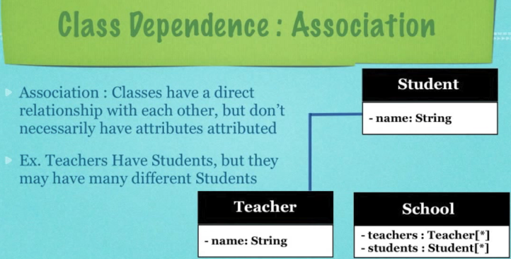

# UML
---

# Class Diagrams

The class diagram is composed of three parts:

Upper section - Name of the class - This section is always required whether you are talking about the classifier or an object.

Middle Section - Attributes of the class - The attributes describe the variables that describe the qualities of the class. This is only required when describing a specific instance of a class.

Bottom section - Class operations (methods) - Displayed in list format, each operation takes up its own line. The operations describe how a class can interact with data.

**Member Access Modifier**

All classes have different access levels depending on the access modifier (visiblity). Here are the following access levels with their corresponding symbols:

- Public (+) 
- Private (-)
- Protected (#)
- Package (~)
- Derived (/)
- Static (underlined)

---

